## 0-Book Overview

本书共计12章

> CMU online course: https://scs.hosted.panopto.com/Panopto/Pages/Sessions/List.aspx#folderID=%22b96d90ae-9871-4fae-91e2-b1627b43e25e%22

1. Tour: The Life Cycle of A Program

2. Representing and Manipulating Information

   2's complement representation

   asymetic

   arithmetic

3. Machine Language

   C to machine language

   how to read

4. Processor

   1 datapath, simple but not efficient

   pipline cpu

   using HCL to generate Verilog code in order to create real circuits

5. Optimizing Program Performance

   some tricks or code pattern that can improve program performance

   discipline that should follow

   utilize the features of 'superscalar' processor

6. Memory

   real hierarchy of memory beyond the conceptual idea

   RAM, ROM, magnetic-disk, solid state drive, ...

7. Linking

   static and dynamic

8. Exceptional Control Flow

   where it comes from

   define process

9. Virtual Memory

   hardware and software

10. System Level I/O

    file reentrance, metadata

    why it is not suitable to use C libs to write network I/O

11. Network Programming

    a mixture of knowledge above, do review if necessary

    write a web severer

12. Concurrent Programming

    manage concurrent process, avoid errors and maintain efficiency

## 1-A Tour of Computer Systems

instruction set architecture

microarchitecture


> Storage devices that are higher in the hierarchy serve as caches for devices that are lower in the hierarchy. 
>
> P57，我觉得这里说反了吧
>
> P44，明明是高一层的结构是把下面一层的结构当成缓冲区

## 2-Representing and Manipulating Information

>  The byte count is specified as having data type size_t, the preferred data type for expressing the sizes of data structures. 
>
>  ```c
>  #include <stdio.h>
>  
>  typedef unsigned char *byte_pointer;
>  
>  void show_bytes(byte_pointer start, size_t len) {
>    int i;
>    for (i = 0; i < len; i++)
>        printf(" %.2x", start[i]);
>    printf("\n");
>  }
>  
>  void show_int(int x) {
>    show_bytes((byte_pointer) &x, sizeof(int));
>  }
>  
>  void show_float(float x) {
>    show_bytes((byte_pointer) &x, sizeof(float));
>  }
>  
>  void show_pointer(void *x) {
>    show_bytes((byte_pointer) &x, sizeof(void *));
>  }
>  ```
>
>  
>
>  P73 类型size_t和int进行比较，不会出现问题吗？我记得之前有次就是由于表示的不统一让结果发生了异常。
>
>  现在没有问题了，强制类型转换的原理是T2U和U2T，以及，使用十六进制表示，不存在整型还是无符号整型的问题，就是内存里面的数值。
>
>  P105 comparison operators with implicit cast between signed and unsigned
>
>  When an operation is performed where one operand is signed and the other is unsigned, **C implicitly casts the signed argument to unsigned** and performs the operations assuming the numbers are nonnegative.


> ```c
> int lval = 0xFEDCBA98 << 32;
> int aval = 0xFEDCBA98 >> 36;
> unsigned uval = 0xFEDCBA98u >> 40;
> 
> lval 0xFEDCBA98
> aval 0xFFEDCBA9
> uval 0x00FEDCBA
> ```
>
> On many machines, the shift instructions consider only the lower log2 w bits of the shift amount when shifting a w-bit value, and so the shift amount is computed as k mod w.
>
> For example, with w = 32, the above three shifts would be computed as if they were by amounts 0, 4, and 8, respectively, giving results

> Sign extension: 
>
> * two's complement representation with leading zeros of course will not change its numeric value
>
> * those with leading ones, namely negative, the values to be substract (namely the original term added at first$-x_{w-1}\cdot 2^{w-1}$) will never change due to the leading ones.
>
>   for example, assuming that we have 1011 as the two's complement representation of -8 + 3 = -5
>
>   | Two's complement representation | computing numeric value    | substracted value      | numeric value |
>   | ------------------------------- | -------------------------- | ---------------------- | ------------- |
>   | 1 011                           | -8 + 3 = -5                | -8                     | -5            |
>   | 1 1011                          | -16 + 8 + 3 = -5           | -16 + 8 = -8           | -5            |
>   | 1 11011                         | -32 + 16 + 8 + 3 = -5      | -32 +16 + 8 = -8       | -5            |
>   | 1 111011                        | -64 + 32 + 16 + 8 + 3 = -5 | -64 + 32 + 16 + 8 = -8 | -5            |
>
> * then, we can grasp the intuition of 'unchanged substracted value' to yield the same numeric value of Two's complement representation

> signed interger type has a stuff of messy things:
>
> * pure digits like 12345 are regarded as signed implicitly, unless specifiy them with a suffix 'U' or 'u' (e.g. 12345U or 12345u)
> * -MAX-1 rather than the exact numeric value, due to the asymmetric property of two's complement representation
> * cast from short signed to int signed, 'sign extention' with leading zeros or ones
> * cast from short to unsigned, the not specified procedure is "byte first, then type": `short (2 bytes) => int (4 bytes)`, `int => unsigned`. byte expansion might add leading ones to yield an unexpected result for final unsigned variable of its numeric values. type casting from int to unsigned remain its every bit unchanged, which would cause the following results:
>
> ```c
> Consider the following code:
> short sx = -12345; /* -12345 */
> unsigned uy = sx; /* Mystery! */
> printf("uy = %u:\t", uy);
> show_bytes((byte_pointer) &uy, sizeof(unsigned));
> 
> When run on a big-endian machine, this code causes the following output to be printed:
> uy = 4294954951: ff ff cf c7
> This shows that, when converting from short to unsigned, the program first changes the size and then the type. That is, (unsigned) sx is equivalent to (unsigned) (int) sx, evaluating to 4,294,954,951, not (unsigned) (unsigned short) sx, which evaluates to 53,191. Indeed, this convention is required by the C standards.
> ```
>
> * moreover, when right shift operator ">>" is used with signed number (including pure digits?), it might result in the arithmetic shift, yield of which is not absolutely guaranteed.  
> * remember that, hex digits 8 through F have their most significant bits equal to 1.


> One way to avoid such bugs is to never use unsigned numbers.

> Problem here, constants shown in codes are implicitly regarded as signed. 
>
> Then problem occurred, if we use it as an operand of shift operation, like unsigned x=11; x = (x<<2); here x is unsigned, so the computation will operate as both unsigned; but if int x=11; x = (x<<2), then both x and the constant 2 are signed, the operation here will be computed regarding both operands as signed, then if set 2 as -2, what will happend?
>
> * The most positive result should be it cannot pass compilation, then my concerns here will be unnecessary.

pp2, solution:**173**/1105

**68**/1105: pp2_3

**85**/1105: pp2_12（精妙，不只是第二题）

> 本质上是数字逻辑不过关（
>
> x XOR 0 = x
>
> x XOR 1 = x'
>
> 还有，sizeof得出的大小是byte，而不是位，对于w长度，需要对其除以8

> mask 的用法，~0x1 would create a mask that regardless of the width of values
>
> The expression ~0xFF creates a mask where the 8 least-significant bits equal 0 and the rest equal 1. Observe that such a mask will be generated regardless of the word size. By contrast, the expression 0xFFFFFF00 would only work when data type int is 32 bits.

**85**/1105: pp2_13（题意理解错）


> printf problem:
>
> > When printing numeric values with printf, the directives %d, %u, and %x are used to print a number as a signed decimal, an unsigned decimal, and in hexadecimal format, respectively. Note that printf does not make use of any type information, and so it is possible to print a value of type int with directive %u and a value of type unsigned with directive %d. 
>
> Actually, printf does use type information, since it must decide to read how many bytes of memory content to be printed on screen. Considering the following code:
>
> ```c
> typedef unsigned char byte;
> 
> int main()
> {
>     int32_t x = 12345;
>     float y = x;
>     byte *px = &x;
>     printf("hexadecimal\ttype\tnumeric value\taddress\n");
>     printf("%8x\tint32\t%10d\t%#p\n", x, x, &x);
>     printf("%8x\tint32\t%10d\t%#p\n", *(px + 0), x, &x); // I meet a strange case that it just indicates printf used the type information, I can only print every byte of x one time.
>     printf("%8x\tint32\t%10d\t%#p\n", *(px + 1), x, &x);
>     printf("%8x\tint32\t%10d\t%#p\n", *(uint32_t *)&x, x, &x);
>     printf("%8x\tfloat\t%10.1f\t%#p\n", *(uint32_t *)&y, y, &y);
> }
> ```
>
> The output looks something like this:
>
> ```shell
> hexadecimal     type    numeric value   address
>     3039        int32        12345      0X000000000061FE0C
>       39        int32        12345      0X000000000061FE0C
>       30        int32        12345      0X000000000061FE0C
>     3039        int32        12345      0X000000000061FE0C
> 4640e400        float      12345.0      0X000000000061FE08
> ```
>
> It failed to print entire value of x through the same address given by \*(px + 0), but when I explicitly cast the pointer type from *byte* type to *unint32_t* type, it yielded the correct hexadecimal value. Thus, there must be some mechanism behind the usage of type information.

> pointer: the smallest position it can operate is byte (unsigned char \*)
>
> hex: every single hexadecimal digit occupied only 4 bits, thus it is necessary to 2-bit hexadecimal digits as the base unit for assignment or mask. For example, use 0x01 rather than 0x1, and if you want to assign 8 bits of memory with [1000 1100], use 0x8c as a whole rather than attempting to assign it through byte pointer each time to assign it 0xc and 0x8 which is wrong.

> E. f == -(-f)
> Yes, since a floating-point number is negated by simply inverting its sign bit.
>
> H. (f+d)-f == d
> No. For example, when f is 1.0e20 and d is 1.0, the expression f+d will be
> rounded to 1.0e20, and so the expression on the left-hand side will evaluate
> to 0.0, while the right-hand side will be 1.0.


## 3-Machine-Level Representation of Programs

> 通过总体来看的话，这章就是用汇编把C语言里面出现的指令，控制，结构等等的东西解释了一遍。
>
> 这里没有区分机器码和汇编，经查阅，确实存在细微的不同，但对于我们正常使用来讲，几乎就是可以忽略的。
>
> 这一章，应该说是可以让我对于C语言是如何设计的有比较深刻的理解。一些奇怪的错误发生的原因也能被解释清楚，相当于是揭示了C语言是如何和底层接轨的。
>
> 接下来正式开始学习了。

prerequisite 

> P194 cannot understand
>
> Our presentation focuses on the types of machine-level programs generated
> when compiling C and similar programming languages targeting modern oper-
> ating systems.

* the history of x86 processor

* general idea of generating machine-level code, parameters of a GCC C Compiler

* 2 important forms of abstraction of computer system for machine-level programming

  * instruction set architecture (ISA)

    > First, the format and behavior of a machine-level program is defined by the
    > instruction set architecture, or ISA, defining the processor state, the format of the
    > instructions, and the effect each of these instructions will have on the state. Most
    > ISAs, including x86-64, describe the behavior of a program as if each instruction is
    > executed in sequence, with one instruction completing before the next one begins.
    > The processor hardware is far more elaborate, executing many instructions con-
    > currently, but it employs safeguards to ensure that the overall behavior matches
    > the sequential operation dictated by the ISA.

  * virtual addresses

    >  Second, the memory addresses used
    > by a machine-level program are virtual addresses, providing a memory model that
    > appears to be a very large byte array. The actual implementation of the mem-
    > ory system involves a combination of multiple hardware memories and operating
    > system software, as described in Chapter 9.

> For accelerating reading efficiency, using block-reading deliberately can be rather important, which can also avoid distraction time waste.

* machine-level instructions can only perform very elementary operations. It is compiler's work to interpret C constructs and generate such instructions for processor.

* generate assembly code without optimization

  ```shell
  gcc -Og -S mstore.c
  ```

  > Note: `-Og` here is O not zero 0.

* machine simply executes a sequence of bytes generated by assembler

  >A key lesson to learn from this is that the program executed by the machine is
  >simply a sequence of bytes encoding a series of instructions. The machine has
  >very little information about the source code from which these instructions were
  >generated.

  Using `gdb` to show the machine code

   ```bash
   (gdb) file mstore.o [Enter]
   Reading symbols from mstore.o...
   (No debugging symbols found in mstore.o)
   (gdb) x/14xb multstore [Enter]
   0x0 <multstore>:        0xf3    0x0f    0x1e    0xfa    0x53    0x48    0x89    0xd3
   0x8 <multstore+8>:      0xe8    0x00    0x00    0x00    0x00    0x48
   ```
  
* Disassembler in Linux `objdump`, run command `$ objdump -d mstore.o`

  ```bash
  
  mstore.o:     file format elf64-x86-64
  
  
  Disassembly of section .text:
  
  0000000000000000 <multstore>:
     0:   f3 0f 1e fa             endbr64
     4:   53                      push   %rbx
     5:   48 89 d3                mov    %rdx,%rbx
     8:   e8 00 00 00 00          callq  d <multstore+0xd>
     d:   48 89 03                mov    %rax,(%rbx)
    10:   5b                      pop    %rbx
    11:   c3                      retq
  ```

* generate prog using the following command

  ```bash
  gcc -Og -o prog main.c mstore.c
  ```

  examine the disassembly file using the following command

  ```bash
  objdump -d prog
  ```

* Web aside

  > Web asides to cover material intended for dedicated machine-language enthusiasts

  > Another Web aside gives a brief presentation of ways to incorporate assembly code into C programs

* There is GCC's support for embedding assembly code directly within C programs (Web aside)

  

* Sixteen integer registers (general-purpose registers), names begin with `%r`, otherwise follow multiple different naming conventions. Some typical name should remember of course (the previous 8 registers): 

  ```assembly
  %rax		return value
  %rbx %rbp	callee saved
  %rsp		stack pointer
  ```

  

* Operand specifiers

  * immediate

  * register

  * memory

    memory references

    effective address

    > there are many different addressing modes allowing different forms of memory references

    The immediate and register references and general form of memory reference are denoted as follow:

    | Type      | Form             | Operand Value                 | Name           |
    | --------- | ---------------- | ----------------------------- | -------------- |
    | Immediate | $\$Imm$          | $Imm$                         | Immediate      |
    | Register  | $r_a$            | $R[r_a]$                      | Register       |
    | Memory    | $Imm(r_b,r_i,s)$ | $M[Imm+R[r_b]+R[r_i]\cdot s]$ | Scaled indexed |

    > This general form is often seen when referencing elements of arrays. 

    >  As we will see, the more complex addressing modes are useful when referencing array and structure elements

    > 被指向的：designated, specified, indicated, pointed, denoted, 

    suffix meaning:

    ```
    a - arbitrary
    b - base
    i - index
    s - scale
    ```

    > 我感觉，在学的过程中把做了的题的答案对了，然后再接着往下做，算是比较合理的做法，因为全部堆在一起有不想对答案的冲动。

* Exception for MOV instructions:

  > For most cases, the mov instructions will only update the specific register bytes
  > or memory locations indicated by the destination operand. The only exception is
  > that when movl has a register as the destination, it will also set the high-order 4
  > bytes of the register to 0. This exception arises from the convention, adopted in
  > x86-64, that any instruction that generates a 32-bit value for a register also sets the
  > high-order portion of the register to 0.

* Understanding how data movement changes a destination register

  

* 这里有个疑问，我不明白他在说什么：

  

  

  

* Problem here

  > Referring to Figure 3.2, register operands for these instructions can be the labeled portions of any of the 16 registers, where the size of the register must match the size designated by the last character of the instruction (‘b’, ‘w’, ‘l’, or ‘q’)

  > https://stackoverflow.com/questions/20247944/chosing-suffix-l-b-w-for-mov-instruction

  > https://stackoverflow.com/questions/57937348/how-to-determine-the-appropriate-mov-instruction-suffix-based-on-the-operands

  > https://web.stanford.edu/class/archive/cs/cs107/cs107.1222/guide/x86-64.html

  Problem done.

  > All of these movs have a register operand that forces a particular size

* Recall

  > Recall that when performing a cast that involves both a size change and a change of “signedness” in C, the operation should change the size first (Section 2.2.6).

  review:

  

* Note: You should follow the casting rules of C, rather than your expected way of casting.

  More exactly, the operating process of these assembly instructions can explain the design reason of casting principles in C

* push and pop operations on stack

  > Since the stack is contained in the same memory as the program code and
  > other forms of program data, programs can access arbitrary positions within the
  > stack using the standard memory addressing methods. For example, assuming the
  > topmost element of the stack is a quad word, the instruction movq 8(%rsp),%rdx
  > will copy the second quad word from the stack to register %rdx.

  In other words, it is quite easy to modify the data in system stack using C pointer, which can be quite dangerous in any cases.

* arithmetic and logical operations (4 groups)

  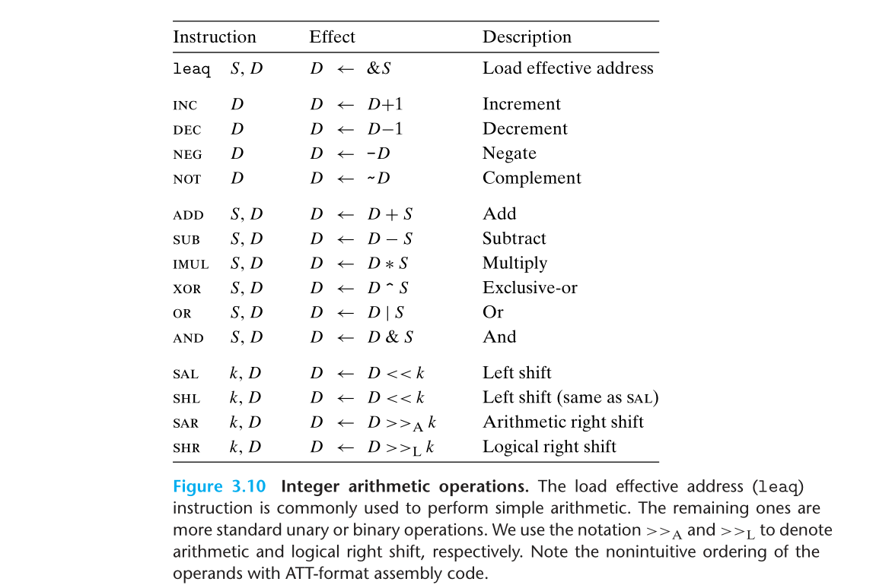

  * load effective address `leaq`

    the most common usage is to attain effective address

    but it can also be used to perform addition and limited forms of multiplication, because it just don't care about the content of designated memory address, just using computation results of the "address" (although it might not be a valid address for dereferrencing).

  * unary

    `incq (%rsp)` the 8-byte element on the top of the stack increments.

    > This syntax is reminiscent of the C increment (++) and decrement (--) operators.

  * binary (nonintuitive ordering of the operands)

    

  * shifts

    **shift amount**, can either be immediate value or with the single-byte register `%cl`. Register as operand can only be the specific `%cl`. There is a convention of 
  
    > With x86-64, a shift instruction operating on data values that are
    > w bits long determines the shift amount from the low-order m bits of register
    > %cl, where $2^m = w$. The higher-order bits are ignored. So, for example, when
    > register %cl has hexadecimal value 0xFF, then instruction salb would shift by
    > 7, while salw would shift by 15, sall would shift by 31, and salq would shift
    > by 63.

    Here, it explains in x86-64 machine what will happen when operating the shift amount that out of the range of bit width of operand. The only low $log_2(w)$-bit of register will be valid, that is, given the $w$-bit value, we shift it with amount $k$, if the value's bit-level representation width 
  
    **the value to shift**
    
  * problem occurred here
  
    
  
    the assembly code shows that, when computing `t1 & 0x0F0F0F0F`, compilter thinks that we only use the value of `%edi`, and that cause a potential contrast between what we assume and the exact assembly code.
  
    Assuming that `t1 = 0xFFFFFFFFffffffff`, after line5, its value changes to `0xFFFFFFFF0f0f0f0f`, in which the higher-bit values remain to 1, but we may expected it to be 0. So that is a problem here.
  
    > But why does csapp text not mention this confusing point?
  
* Special Arithmetic Operations

  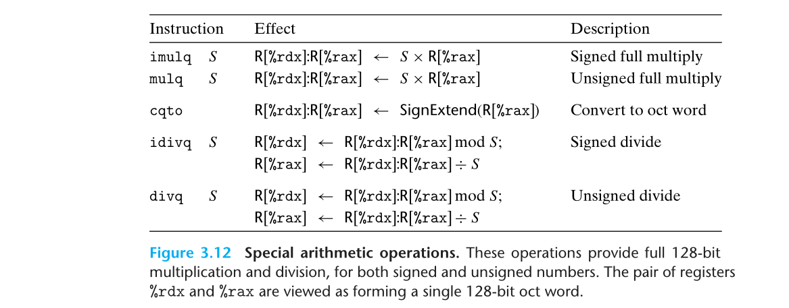

* using the 128-bit result

  ```c
  #include <inttypes.h>
  
  typedef unsigned __int128 uint128_t;
  
  void store_uprod(uint128_t *dest, uint64_t x, uint64_t y)
  {
      *dest = x * (uint128_t)y;
  }
  ```

  generated assembly code is as follows (readable part):

  ```assembly
  store_uprod:
  .LFB4:
          .cfi_startproc
          endbr64
          movq    %rsi, %rax
          mulq    %rdx
          movq    %rax, (%rdi)
          movq    %rdx, 8(%rdi)
          ret
          .cfi_endproc
  ```

  > Observe that storing the product requires two movq instructions: one for the
  > low-order 8 bytes (line 4), and one for the high-order 8 bytes (line 5). Since the
  > code is generated for a little-endian machine, the high-order bytes are stored at
  > higher addresses, as indicated by the address specification 8(%rdi).

* for division, the result of assemling is not that obvious, it include function call

  ```assembly
  store_divident:
  .LFB4:
          .cfi_startproc
          endbr64
          pushq   %rbx
          .cfi_def_cfa_offset 16
          .cfi_offset 3, -16
          movq    %rdi, %rbx
          movq    %rsi, %rdi
          movq    %rdx, %rsi
          movq    %rcx, %rdx
          movl    $0, %ecx
          call    __udivti3@PLT
          movq    %rax, (%rbx)
          movq    %rdx, 8(%rbx)
          popq    %rbx
          .cfi_def_cfa_offset 8
          ret
          .cfi_endproc
  ```

  > The signed division instruction idivl takes as its dividend the 128-bit quantity
  > in registers %rdx (high-order 64 bits) and %rax (low-order 64 bits). The divisor is
  > given as the instruction operand. The instruction stores the quotient in register
  > %rax and the remainder in register %rdx.

* 他教材这里在说什么？这里addition可能是笔误

  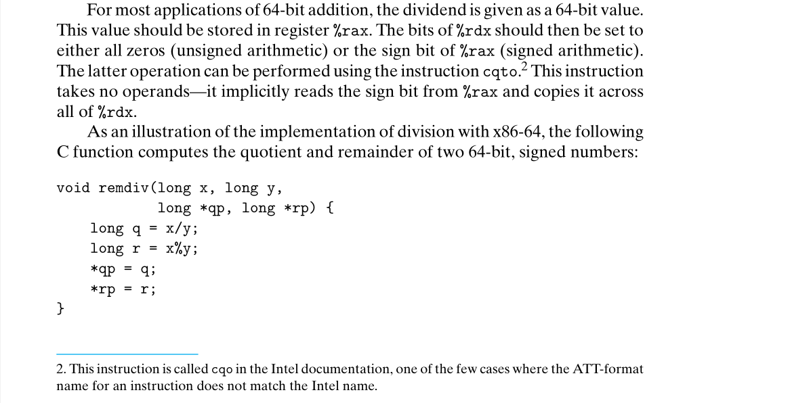


* 感觉这里可能是笔误

  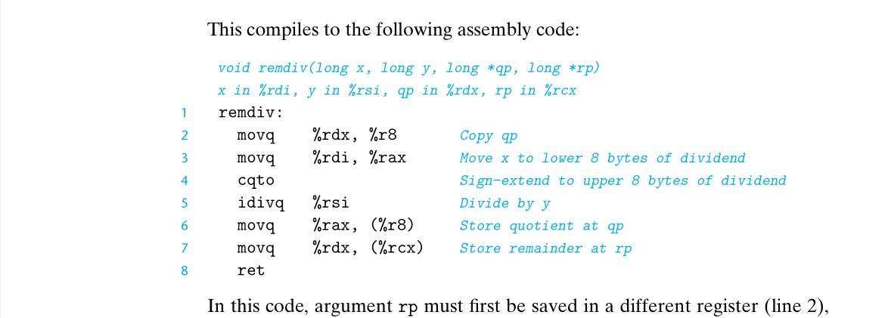

---

straight-line constructs end, control constructs start

---

* machine code provide 2 basic low-level machanisms to implement the conditional behavior

  > it tests data values and then alters either the **control flow** or the **data flow** based on the results of these tests.

* some useful flags

  

  

* details

  >The `leaq` instruction does not alter any condition codes, since it is intended to be used in address computations. 
  >
  >Otherwise, all of the instructions listed in Figure 3.10 cause the condition codes to be set. 
  >
  >For the **logical operations**, such as `xor`, the carry and overflow flags are set to zero. 
  >
  >For the **shift operations**, the carry flag is set to the last bit shifted out, while the overflow flag is set to zero. 
  >
  >For reasons that we will not delve into, the `inc` and `dec` instructions set the overflow and zero flags, but they leave the carry flag unchanged.

  | instruction type       | example      | CF                       | ZF   | SF   | OF   |
  | ---------------------- | ------------ | ------------------------ | ---- | ---- | ---- |
  | load effictive address | `leaq`       | \                        | \    | \    | \    |
  | logical operations     | `xor`        | 0                        |      |      | 0    |
  | shift operations       |              | the last bit shifted out |      |      | 0    |
  |                        | `inc`, `dec` | \                        | set  |      | set  |

  \: unchanged

  0: set to zero

  1: set to one

* conditional instructions

  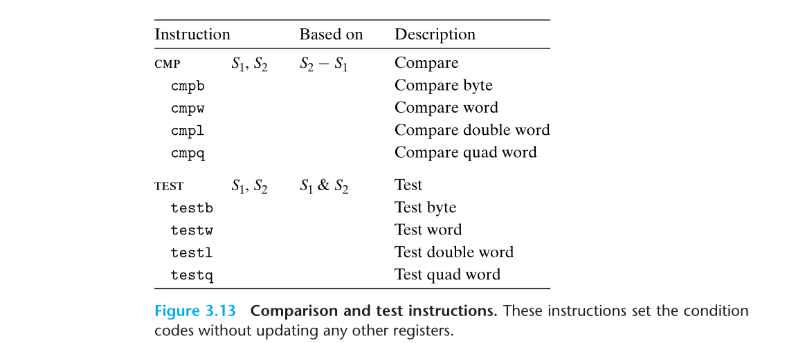

  * `cmp`, the same as `sub` but not alter the destination value
  * `test`, the same as `and` but not alter the destination value

  > Typically, the same operand is repeated (e.g., `testq %rax,%rax` to see whether `%rax` is negative, zero, or positive), or one of the operands is a mask indicating which bits should be tested.

* suffixs of `set` instructions indicate different meaning as we have used before

  The value of the condition registers are not accessable (I guess), so it turns out to be a usefull way for use `set` instructions to access these values indirectly.

  The `set` instructions can only set 1-byte of register (that is, the lower-order single byte register), or 1-byte of memory block. So if we expected to set a 32-bit or 64-bit result, more instructions should be generated as supplement of their function.

* example

  >When **no overflow** occurs (indicated by having **OF set to 0**), we will have a < b when a -t w b < 0, indicated by having **SF set to 1**, and a ≥ b when a -t w b ≥ 0, indicated by having **SF set to 0**. 
  >
  >On the other hand, when **overflow occurs**, we will have a < b when a -t w b > 0 (negative overflow) and a > b when a -t w b < 0 (positive overflow). 
  >
  >We cannot have overflow when a = b. 
  >
  >Thus, when OF is set to 1, we will have a < b if and only if SF is set to 0. Combining these cases, the exclusive-or of the overflow and sign bits provides a test for whether a < b. The other signed comparison tests are based on other combinations of SF ^ OF and ZF.

  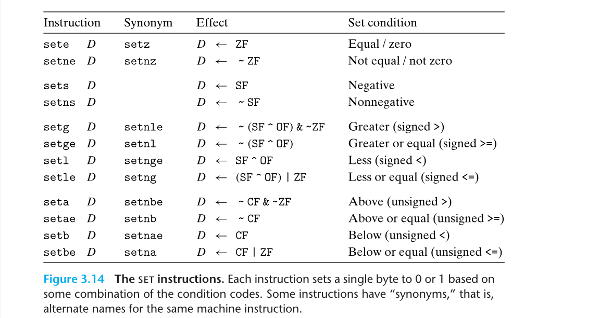

  > Todo: 这里的公式可能需要推导来熟悉

* > It is important to note how machine code does or does not distinguish be-
  > tween signed and unsigned values. Unlike in C, it does not associate a data type
  > with each program value. Instead, it mostly uses the same instructions for the two
  > cases, because many arithmetic operations have the same bit-level behavior for
  > unsigned and two’s-complement arithmetic. Some circumstances require different
  > instructions to handle signed and unsigned operations, such as using differ-
  > ent versions of right shifts, division and multiplication instructions, and different
  > combinations of condition codes.

* jump

  

  > **PC relative**. That is, they encode the difference between the address of the target instruction and the address of the instruction immediately following the jump.

  > A second encoding method is to give an “absolute” address, using 4 bytes to directly specify the target. 

* describe a machine code with C code

  

  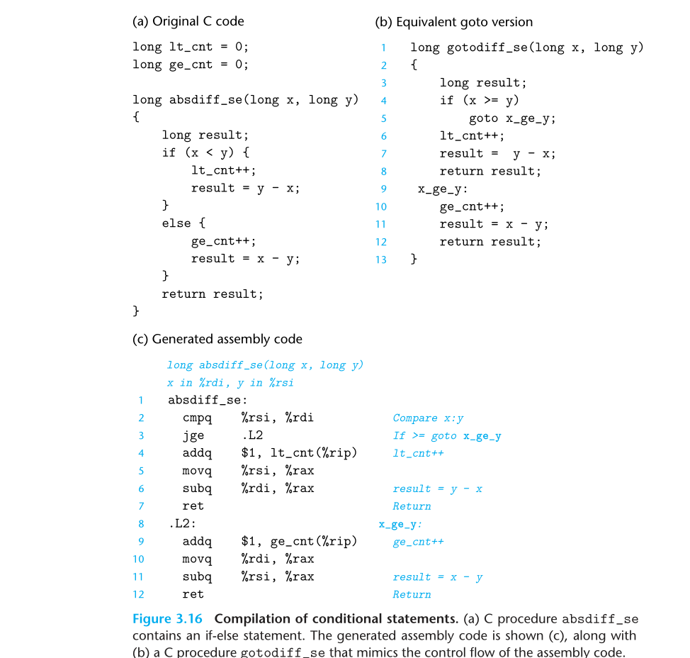

* general difference between `if-else` statement in C and the jump condition control flow in machine code (in C syntax)

  

* 这里记录一下，代码写错了之后的有趣的表现

  原始c代码

  ```c
  long lt_cnt = 0;
  long ge_cnt = 0;
  
  long absdiff_se(long x, long y)
  {
      long result;
      if (x < y)
      {
          lt_cnt++;
          result = y - x;
      }
      else
      {
          ge_cnt++;
          result = x - y;
      }
      return result;
  }
  
  long absdiff_new(long x, long y)
  {
      long result;
      if (x < y)
          goto label;
      ge_cnt++;
      result = x - y; // 注意，这里没有返回值
  label:
      lt_cnt++;
      result = y - x;
      return result;
  }
  ```

  汇编代码

  ```assembly
  absdiff_se:
  .LFB0:
          .cfi_startproc
          endbr64
          movq    %rsi, %rax
          cmpq    %rsi, %rdi
          jge     .L2
          addq    $1, lt_cnt(%rip)
          subq    %rdi, %rax
          ret
  .L2:
          addq    $1, ge_cnt(%rip)
          subq    %rsi, %rdi
          movq    %rdi, %rax
          ret
          .cfi_endproc
  
  absdiff_new:
  .LFB1:
          .cfi_startproc
          endbr64
          movq    %rsi, %rax
          cmpq    %rsi, %rdi
          jl      .L5
          addq    $1, ge_cnt(%rip)  @ 我们可以看到，这里GCC直接跳过了之前写的result = x - y，因为我写漏了返回值
  .L5:
          addq    $1, lt_cnt(%rip)
          subq    %rdi, %rax
          ret
          .cfi_endproc
  ```

* conditonal transfer of **control**

* conditional transfer of **data**

  which exploit the high performance of modern processor in piplining

  > Processors employ sophisticated branch pre-
  > diction logic to try to guess whether or not each jump instruction will be followed.
  > As long as it can guess reliably (modern microprocessor designs try to achieve
  > success rates on the order of 90%), the instruction pipeline will be kept full of
  > instructions

  > an intuitive thought is using machine learning methods, especially reinforce learning (combat 2 processors)

  > As a consequence, the **branch misprediction penalty** dominates the performance of this function. 

  conditional jumps, conditional moves

  

* Conditional move instrucions

  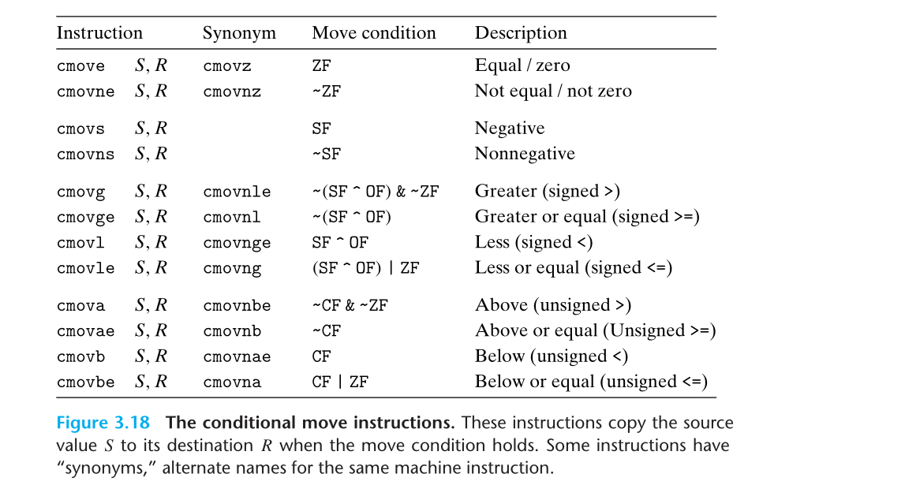

* the condition that can not be implememted with condition move

  > Not all conditional expressions can be compiled using conditional moves. Most significantly, the abstract code we have shown evaluates both then-expr and else-expr regardless of the test outcome. 
  >
  > If one of those two expressions could possibly **generate an error condition** or a **side effect**, this could lead to invalid behavior. Such is the case for our earlier example (Figure 3.16). Indeed, we put the side effects into this example specifically to force gcc to implement this function using conditional transfers.

  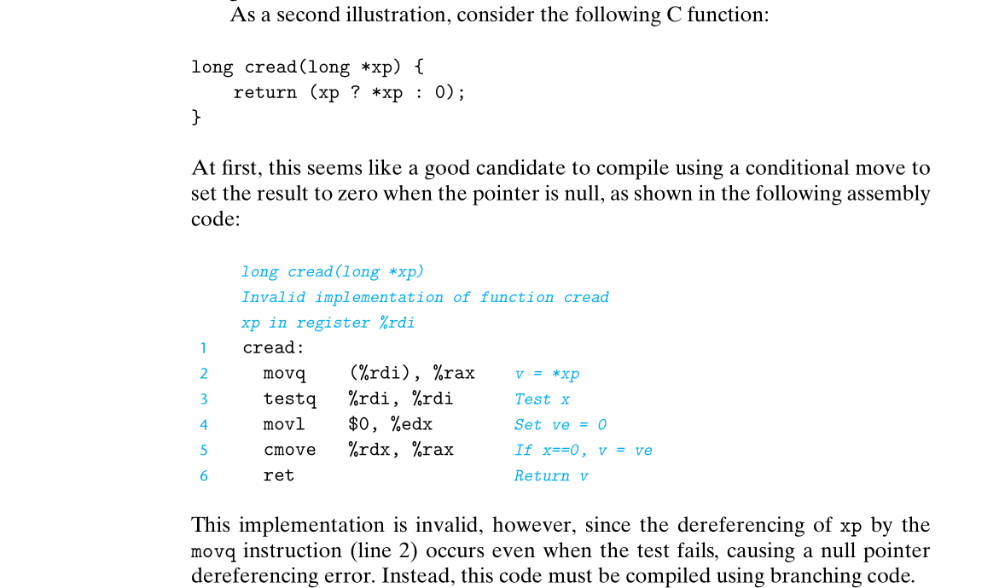

* even with the help of GCC compiler to use condition data transfers, it is still necessary to do so for programmer due to the following reasons.

  > Our experiments with gcc indicate that it only uses conditional
  > moves when the two expressions can be computed very easily, for example, with
  > single add instructions. In our experience, gcc uses conditional control transfers
  > even in many cases where the cost of branch misprediction would exceed even
  > more complex computations.

* review: 2.3.7

  

  

  

* Loops

  > Gcc and other compilers generate loop code based on the two basic loop patterns

  > https://stackoverflow.com/questions/43558039/which-one-of-the-registers-are-being-returned

  

* registers will not distinguish the data type, that means addresses (or pointers) are equivalent to integer.

* note that, in assembly code there is only the kind of expression, cmp jump, rather than do something

* Note, the true meaning of the following statement

  ```assembly
  leaq    (,%rsi,%rdi), %rdx
  addq    %rdx, %rax
  ```

  > %rdx <- 0 + %rsi * %rdi, **here**
  >
  > %rax += %rdx

* Problem `val & 0`

  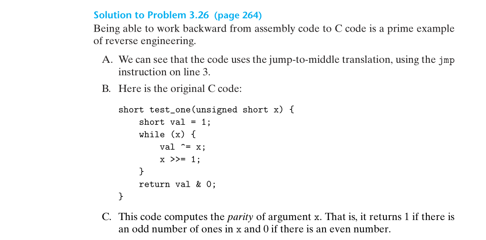

* 计算: compute, evaluate

* A quite tough one to fix

  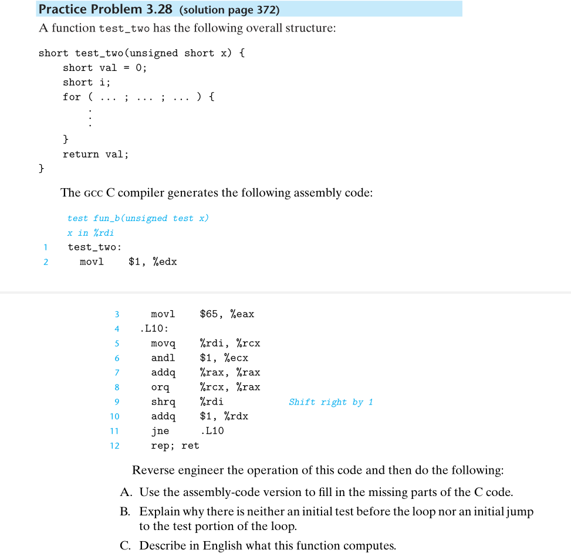

* jump table

  > When reading the codes, memorize the general structure of it, not the details.

  > **my current weakness in this chapter** 260-266, **switch**
  >
  > **and indirect jump**
  >
  > possible cause: skimming, which lead to the same reading way as my chinese reading
  >
  > I should always reading word by word, just do skimming once a while.
  >
  > reading while thinking, that is, to preguess what the author want to convey and the exact structure of the sentence

* arguement limitaion

  > Procedure P can pass up to six integral values (i.e., pointers and integers) on the stack, but if Q requires more arguments, these can be stored by P within its stack frame prior to the call.

* run-time stack frames

  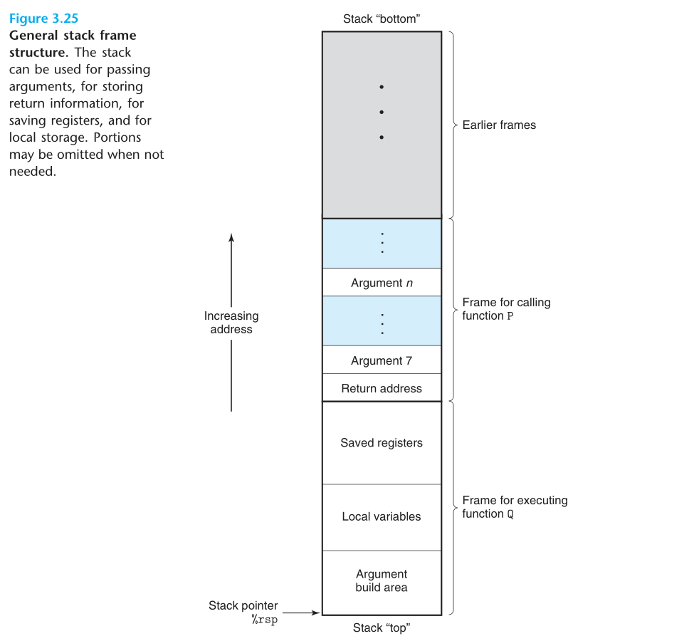

* The may explain why we get used to the "stack cost by recurssive calls", rather than general stack overhead

  

* `rip` is the instruction pointer

  **NOTE:** The stack pointer register always indecates the top of the stack, and with each **push, `*%rsp` will increase** by 8 bytes, each **pop, it will decrease** by 8 bytes!!!!!

  > Problem still exists when considering the return value from assembly code? Is it the default register `%rax`?

* arguments allocation number of the 6 integral registers, the order is specified.

  > The registers are used in a specified order, with the name used for a register depending on the size of the data type being passed.

  

* alignment

  > When passing parameters on the stack, all data sizes are rounded up to be multiples of eight (**bytes**)

  Note the different notations of memory referencing and register.

* 看到这段汇编代码，我大声疾呼，“妙啊！”

  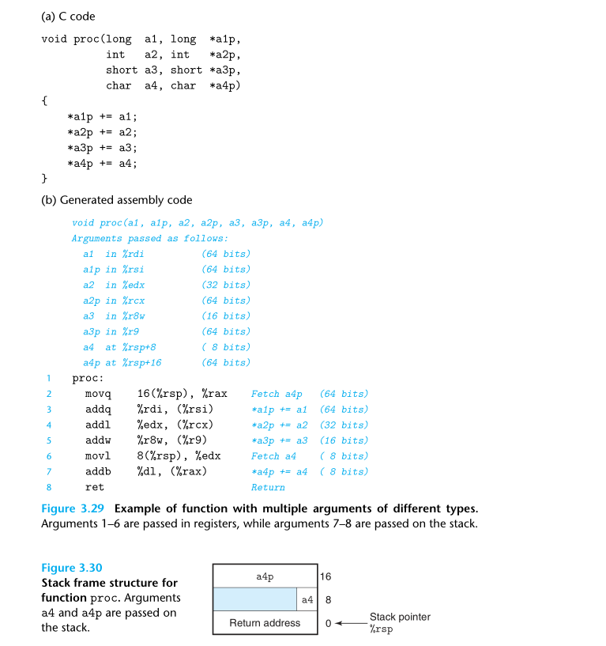

* missing point: the implicit casting in the expression `(*v) += b`, which can only tell that we can copy the value of b to (*v), but we cannot assure through the register type directly.

  > We can also see that the low-order byte of argument b is added to the byte pointed to by %rcx. 
  >
  > This implies that v must be of type char *, but the type of b is ambiguous—it could be 1, 2, 4, or 8 bytes long. 

  ```assembly
  procprob:
      movslq    %edi, %rdi      // we can tell that the value stored in %edi is exactly "double word" because of the movslq instruction
      addq      %rdi, (%rdx)
      addb      %sil, (%rcx)    // but we cannot determine the length of value store in %rsi, because we can simply use the truncation of original stored value.
  ```

* it is illegal to try accessing a register address according to C standard

  > [](https://www.quora.com/profile/Ken-Gregg)
  >
  > **[Ken Gregg](https://www.quora.com/profile/Ken-Gregg)**, Working with C/C++/C# and assembly languages for decades
  >
  > [Answered 2 years ago](https://www.quora.com/In-the-C-language-why-cant-we-take-the-address-of-a-variable-declared-register/answer/Ken-Gregg) · Author has **4.9K** answers and **20M** answer views
  >
  > While there are a few CPU architectures in which registers are mapped to memory locations, in the vast majority of CPU architectures registers are memory are complete separate entities.When something resides in a CPU register, it has no memory address. It is accessed by accessing the CPU register. So, taking the address of something that is stored in a register doesn’t make sense. If it had a memory address, it would be sitting in memory and not sitting in a register.When we tell the C compiler to place a variable in a register (if possible, since this is really only a hint to the compiler), we are effectively saying that the variable should always be in a register and doesn’t need to be in memory at all. It makes no sense to get the memory address of a variable that we have told the compiler shouldn’t be in memory.That’s the logic behind the rule.The C standard states explicitly that operand of the unary address-of operator & must not be declared with the register storage class:“The operand of the unary & operator shall be either a function designator, the result of a [] or unary * operator, or an lvalue that designates an object that is not a bit-field *and is not declared with the register storage-class specifier*.”
  > \- C11 6.5.3.2It’s that statement in the standard that makes it illegal to take the address of a register variable. The rule is enforced, even if the compiler doesn’t assign the variable to a CPU register.Note that the register keyword is just a hint, and the extent to which the compiler actually takes the hint is implementation-defined. For more about the register keyword in C and C++, have a look at this blog post: [Death of the register keyword may be greatly exaggerated](https://blog.bytellect.com/software-development/c-cplusplus/death-of-register-keyword-may-be-exaggerated/)

* Take care of the differences in computing the similar arguements

  

* A detailed example of run-time stack, write assembly code corresponding to the C code

  ```c
  long call_proc()
  {
      long  x1 = 1;
      int   x2 = 2;
      short x3 = 3;
      char  x4 = 4;
      proc(x1, &x1, x2, &x2, x3, &x3, x4, &x4);
      return (x1+x2)*(x3-x4);
  }
  ```

  brain-generated assembly code :) (wrong)

  ```assembly
  call_proc:
      subq  $40, %rsp				//32
      movq  $1, (%rsp)
      movl  $2, 0x08(%rsp)
      movw  $3, 0x10(%rsp)
      movb  $4, 0x18(%rsp)
      leaq  0x18(%rsp),0x20(%rsp)  # leaq 17(%rsp), %rax
      movq  (%rsp), %rdi
      movq  %rsp, %rsi
      movl  0x08(%rsp), %rdx
      leaq  0x08(%rsp), %rcx
      movw  0x10(%rsp), %r8
      leaq  0x10(%rsp), %r9
  #    leaq  0x18(%rsp),0x20(%rsp) 
      call  proc
      movslq  ..., %rdx
      addq   ..., %rdx// why convert to int
      movsbl
      ...
  ```

  the correct assembly code generated by `GCC`, (278/1105)

  ```assembly
  # long call_proc()
  call_proc:  # Set up arguments to proc
      subq    $32, %rsp         # Allocate 32-byte stack frame
      movq    $1, 24(%rsp)      # Store 1 in &x1
      movl    $2, 20(%rsp)      # Store 2 in &x2
      movw    $3, 18(%rsp)      # Store 3 in &x3
      movb    $4, 17(%rsp)      # Store 4 in &x4
      leaq    17(%rsp), %rax    # Create &x4
      movq    %rax, 8(%rsp)     # Store &x4 as argument 8
      movl    $4, (%rsp)        # Store 4 as argument 7
      leaq    18(%rsp), %r9     # Pass &x3 as argument 6
      movl    $3, %r8d          # Pass 3 as argument 5
      leaq    20(%rsp), %rcx    # Pass &x2 as argument 4
      movl    $2, %edx          # Pass 2 as argument 3
      leaq    24(%rsp), %rsi    # Pass &x1 as argument 2
      movl    $1, %edi          # Pass 1 as argument 1
      # Call proc
      call      proc            # Retrieve changes to memory
      movslq    20(%rsp), %rdx  # Get x2 and convert to long
      addq      24(%rsp), %rdx  # Compute x1+x2
      movswl    18(%rsp), %eax  # Get x3 and convert to int
      movsbl    17(%rsp), %ecx  # Get x4 and convert to int
      subl      %ecx, %eax      # Compute x3-x4
      cltq                      # Convert to long
      imulq     %rdx, %rax      # Compute (x1+x2) * (x3-x4)
      addq      $32, %rsp       # Deallocate stack frame
      ret
  ```

  the run-time stack frame for function `call_proc`

  

* Local storage in register, callee-saved registers

  > Although only one procedure can be active at a given time, we must make sure that when one procedure (the caller) calls another (the callee), the callee does not overwrite some register value that the caller planned to use later

  > Procedure Q can preserve a register value by either **not changing it at all** or by **pushing the original value on the stack**, altering it, and then popping the old value from the stack before returning.

  callee-saved registers list: **`%rbx, %rbp, %r12-%r15`**

* caller-saved registers

  > All other registers, except for the stack pointer %rsp, are classified as caller-saved registers. This means that they can be modified by any function. The name “caller saved” can be understood in the context of a procedure P having some local
  > data in such a register and calling procedure Q. Since Q is free to alter this register, **it is incumbent upon P (the caller) to first save the data** before it makes the call.

* array allocation and access

  one problem I always have in mind is what the machanism of C to store the array length information, which can be used to determine the value of `sizeof(array)` to be the length of entire array memory block rather than size of certain type of pointer

  ```c
  // 非数组
  #define _sizeof(T) ((size_t)((T*)0 + 1))
  // 数组
  #define array_sizeof(T) ((size_t)(&T+1)-(size_t)(&T))
  ```

* the solution may be wrong, I think the expression `P[i*6-5]` cannot be represented by 1 assembly instruction as the shortcut shows, which omitted that the memory referrencing scalar cannot be 12

  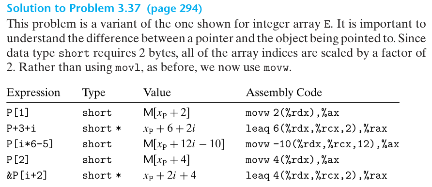

  my answer is to use `mull $6, %rcx` first, then `movw -10(%rdx, %rcx, 2), %ax`

* > The general principles of array allocation and referencing hold when even we create arrays of arrays. For example, the declaration
  >
  > ```c
  > int A[5][3];
  > ```
  >
  > is equivalent to the declaration
  >
  > ```c
  > typedef int row3_t[3];
  > row3_t A[5];
  > ```
  >
  > Data type row3_t is defined to be an array of three integers. Array A contains five such elements, each requiring 12 bytes to store the three integers. The total array size is then 4 . 5 . 3 = 60 bytes.

* > Todo: 多维度数组指针需要复习，现在已经想不清楚了。

  > 一个解决办法是，用数组的方括号记号，这样就不会混乱了。

* Note that, the `cltq` in line 3 is easy to be omitted, which will cause the incompatible register length

  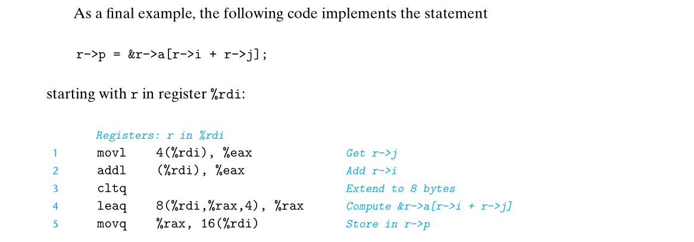

  > As these examples show, **the selection of the different fields of a structure is handled completely at compile time**. The machine code contains no information about the field declarations or the names of the fields

* The usage of union

  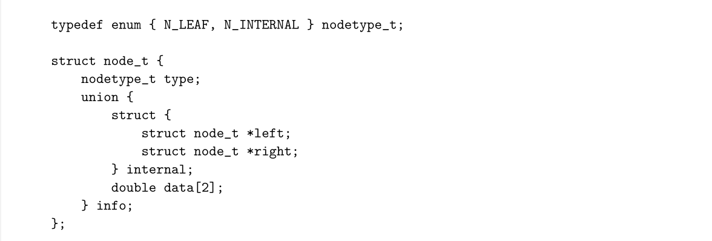

* Notice the little-endian problem

  

* Union used as part of a function to exploit the bit-level representation is quite powerful.

* pp3.43 300/1105 not solved

* alignment

  > Any primitive object of K bytes must have an address that is a multiple of K

  

* a mandatory of alignment

  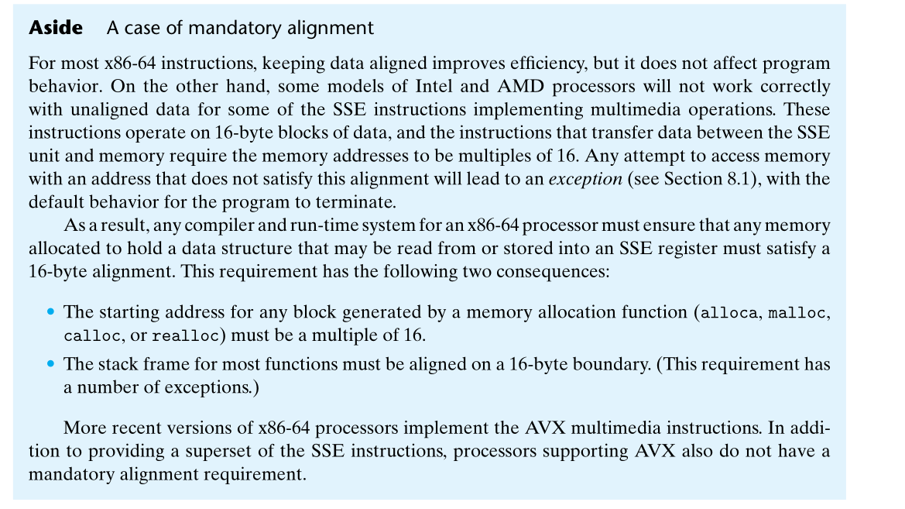

* padding

  https://stackoverflow.com/questions/119123/why-isnt-sizeof-for-a-struct-equal-to-the-sum-of-sizeof-of-each-member/119128#119128

  struct

  http://c-faq.com/struct/align.esr.html

* 习题，我无法理解 3.44,3.45 304/305

* function pointer

  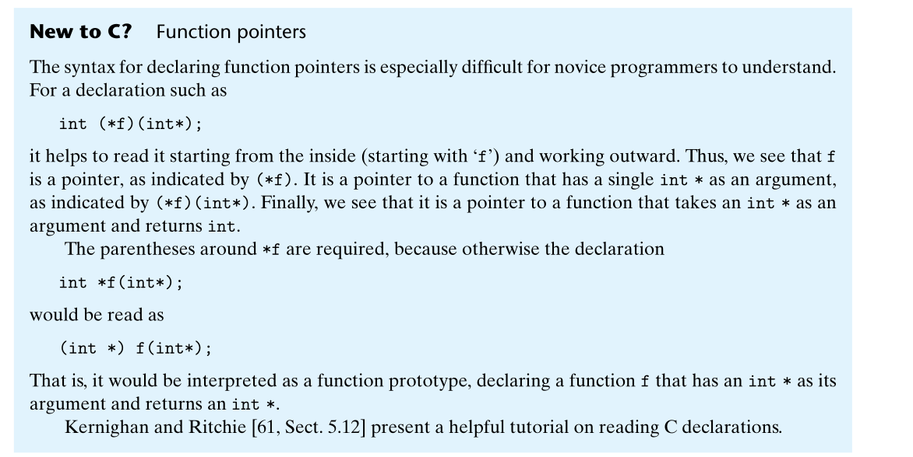

* GDB command line

  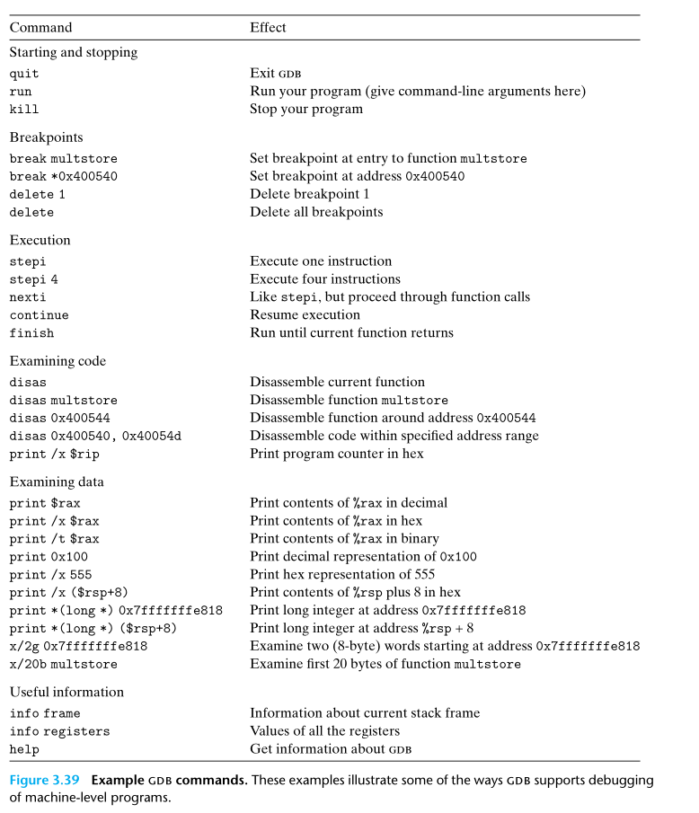

* buffer overflow

* for linux the stack randomization has been adapted as a common practice, but it is just not a default case in windows 10

  > Stack randomization has become standard practice in Linux systems. It is one of a larger class of techniques known as **address-space layout randomization**, or **ASLR [99]**

  

* stack-checking code 10000 times to get possible address, then compute the approximate range of address, and then compute the attempts time it need.

* Problem here, what is the 1-bit flag

  > Historically, the x86 architecture merged the read and exe-
  > cute access controls into a single 1-bit flag, so that any page marked as readable
  > was also executable. The stack had to be kept both readable and writable, and
  > therefore the bytes on the stack were also executable

  > More recently, AMD introduced an NX (for “no-execute”) bit into the mem-
  > ory protection for its 64-bit processors, separating the read and execute access
  > modes, and Intel followed suit. With this feature, the stack can be marked as be-
  > ing readable and writable, but not executable, and the checking of whether a page
  > is executable is performed in hardware, with no penalty in efficiency.

* summary of the machanisms used to minimize the vulnerability of programs to buffer overflows

* variable-size stack frame

  > To manage a variable-size stack frame, x86-64 code uses register `%rbp` to serve as a frame pointer (sometimes referred to as a **base pointer**, and hence the letters bp in `%rbp`)

* > 目前的状态有点不想学，那就开始做实验等把这段时间撑过去然后再继续学剩的。

* early implementations of C++ are directly relied upon C.

  > In fact, early implementations of C++ first performed a source-to-source conversion from C++ to C and generated object code by running a C compiler on the result. C++ objects are represented by structures, similar to a C struct. Methods are represented by pointers to the code implementing the methods.

