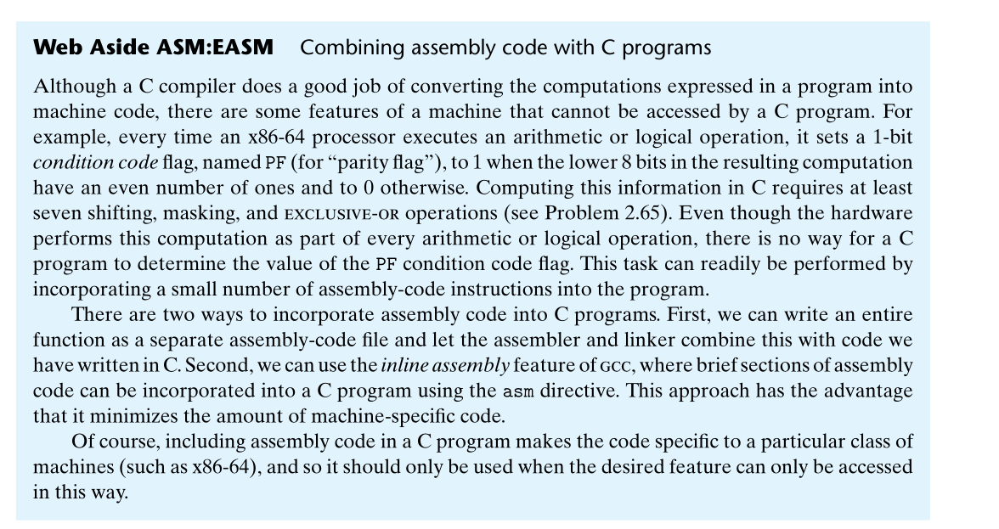
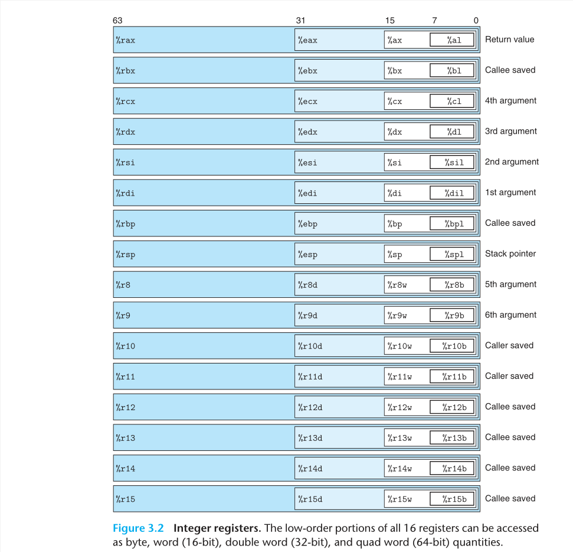
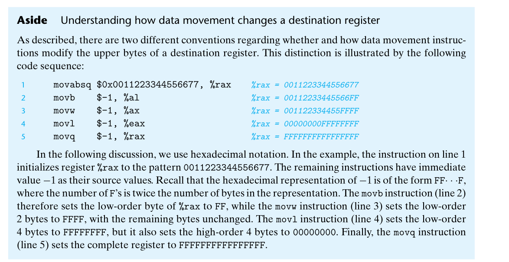
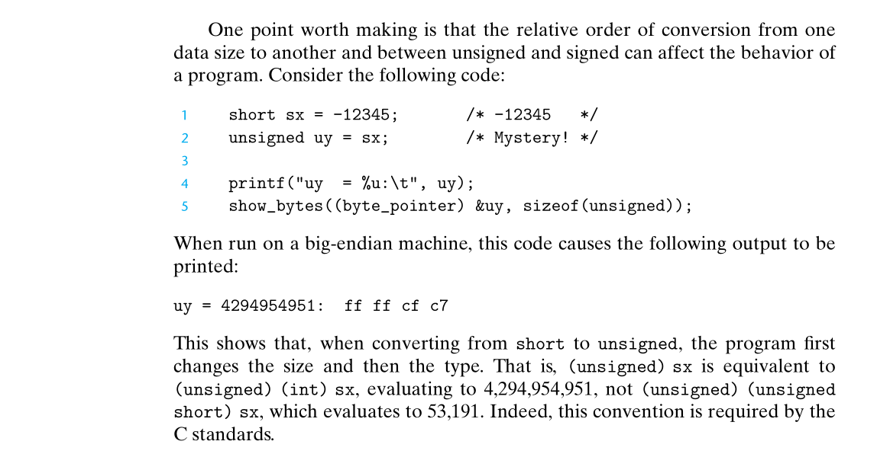

## 0-Book Overview

本书共计12章

1. Tour: The Life Cycle of A Program

2. Representing and Manipulating Information

   2's complement representation

   asymetic

   arithmetic

3. Machine Language

   C to machine language

   how to read

4. Processor

   1 datapath, simple but not efficient

   pipline cpu

   using HCL to generate Verilog code in order to create real circuits

5. Optimizing Program Performance

   some tricks or code pattern that can improve program performance

   discipline that should follow

   utilize the features of 'superscalar' processor

6. Memory

   real hierarchy of memory beyond the conceptual idea

   RAM, ROM, magnetic-disk, solid state drive, ...

7. Linking

   static and dynamic

8. Exceptional Control Flow

   where it comes from

   define process

9. Virtual Memory

   hardware and software

10. System Level I/O

    file reentrance, metadata

    why it is not suitable to use C libs to write network I/O

11. Network Programming

    a mixture of knowledge above, do review if necessary

    write a web severer

12. Concurrent Programming

    manage concurrent process, avoid errors and maintain efficiency

## 1-A Tour of Computer Systems

instruction set architecture

microarchitecture


> Storage devices that are higher in the hierarchy serve as caches for devices that are lower in the hierarchy. 
>
> P57，我觉得这里说反了吧
>
> P44，明明是高一层的结构是把下面一层的结构当成缓冲区

## 2-Representing and Manipulating Information

>  The byte count is specified as having data type size_t, the preferred data type for expressing the sizes of data structures. 
>
>  ```c
>  #include <stdio.h>
>  
>  typedef unsigned char *byte_pointer;
>  
>  void show_bytes(byte_pointer start, size_t len) {
>    int i;
>    for (i = 0; i < len; i++)
>        printf(" %.2x", start[i]);
>    printf("\n");
>  }
>  
>  void show_int(int x) {
>    show_bytes((byte_pointer) &x, sizeof(int));
>  }
>  
>  void show_float(float x) {
>    show_bytes((byte_pointer) &x, sizeof(float));
>  }
>  
>  void show_pointer(void *x) {
>    show_bytes((byte_pointer) &x, sizeof(void *));
>  }
>  ```
>
>  
>
>  P73 类型size_t和int进行比较，不会出现问题吗？我记得之前有次就是由于表示的不统一让结果发生了异常。
>
>  现在没有问题了，强制类型转换的原理是T2U和U2T，以及，使用十六进制表示，不存在整型还是无符号整型的问题，就是内存里面的数值。
>
>  P105 comparison operators with implicit cast between signed and unsigned
>
>  When an operation is performed where one operand is signed and the other is unsigned, **C implicitly casts the signed argument to unsigned** and performs the operations assuming the numbers are nonnegative.


> ```c
> int lval = 0xFEDCBA98 << 32;
> int aval = 0xFEDCBA98 >> 36;
> unsigned uval = 0xFEDCBA98u >> 40;
> 
> lval 0xFEDCBA98
> aval 0xFFEDCBA9
> uval 0x00FEDCBA
> ```
>
> On many machines, the shift instructions consider only the lower log2 w bits of the shift amount when shifting a w-bit value, and so the shift amount is computed as k mod w.
>
> For example, with w = 32, the above three shifts would be computed as if they were by amounts 0, 4, and 8, respectively, giving results

> Sign extension: 
>
> * two's complement representation with leading zeros of course will not change its numeric value
>
> * those with leading ones, namely negative, the values to be substract (namely the original term added at first$-x_{w-1}\cdot 2^{w-1}$) will never change due to the leading ones.
>
>   for example, assuming that we have 1011 as the two's complement representation of -8 + 3 = -5
>
>   | Two's complement representation | computing numeric value    | substracted value      | numeric value |
>   | ------------------------------- | -------------------------- | ---------------------- | ------------- |
>   | 1 011                           | -8 + 3 = -5                | -8                     | -5            |
>   | 1 1011                          | -16 + 8 + 3 = -5           | -16 + 8 = -8           | -5            |
>   | 1 11011                         | -32 + 16 + 8 + 3 = -5      | -32 +16 + 8 = -8       | -5            |
>   | 1 111011                        | -64 + 32 + 16 + 8 + 3 = -5 | -64 + 32 + 16 + 8 = -8 | -5            |
>
> * then, we can grasp the intuition of 'unchanged substracted value' to yield the same numeric value of Two's complement representation

> signed interger type has a stuff of messy things:
>
> * pure digits like 12345 are regarded as signed implicitly, unless specifiy them with a suffix 'U' or 'u' (e.g. 12345U or 12345u)
> * -MAX-1 rather than the exact numeric value, due to the asymmetric property of two's complement representation
> * cast from short signed to int signed, 'sign extention' with leading zeros or ones
> * cast from short to unsigned, the not specified procedure is "byte first, then type": `short (2 bytes) => int (4 bytes)`, `int => unsigned`. byte expansion might add leading ones to yield an unexpected result for final unsigned variable of its numeric values. type casting from int to unsigned remain its every bit unchanged, which would cause the following results:
>
> ```c
> Consider the following code:
> short sx = -12345; /* -12345 */
> unsigned uy = sx; /* Mystery! */
> printf("uy = %u:\t", uy);
> show_bytes((byte_pointer) &uy, sizeof(unsigned));
> 
> When run on a big-endian machine, this code causes the following output to be printed:
> uy = 4294954951: ff ff cf c7
> This shows that, when converting from short to unsigned, the program first changes the size and then the type. That is, (unsigned) sx is equivalent to (unsigned) (int) sx, evaluating to 4,294,954,951, not (unsigned) (unsigned short) sx, which evaluates to 53,191. Indeed, this convention is required by the C standards.
> ```
>
> * moreover, when right shift operator ">>" is used with signed number (including pure digits?), it might result in the arithmetic shift, yield of which is not absolutely guaranteed.  
> * remember that, hex digits 8 through F have their most significant bits equal to 1.


> One way to avoid such bugs is to never use unsigned numbers.

> Problem here, constants shown in codes are implicitly regarded as signed. 
>
> Then problem occurred, if we use it as an operand of shift operation, like unsigned x=11; x = (x<<2); here x is unsigned, so the computation will operate as both unsigned; but if int x=11; x = (x<<2), then both x and the constant 2 are signed, the operation here will be computed regarding both operands as signed, then if set 2 as -2, what will happend?
>
> * The most positive result should be it cannot pass compilation, then my concerns here will be unnecessary.

pp2, solution:**173**/1105

**68**/1105: pp2_3

**85**/1105: pp2_12（精妙，不只是第二题）

> 本质上是数字逻辑不过关（
>
> x XOR 0 = x
>
> x XOR 1 = x'
>
> 还有，sizeof得出的大小是byte，而不是位，对于w长度，需要对其除以8

> mask 的用法，~0x1 would create a mask that regardless of the width of values
>
> The expression ~0xFF creates a mask where the 8 least-significant bits equal 0 and the rest equal 1. Observe that such a mask will be generated regardless of the word size. By contrast, the expression 0xFFFFFF00 would only work when data type int is 32 bits.

**85**/1105: pp2_13（题意理解错）


> printf problem:
>
> > When printing numeric values with printf, the directives %d, %u, and %x are used to print a number as a signed decimal, an unsigned decimal, and in hexadecimal format, respectively. Note that printf does not make use of any type information, and so it is possible to print a value of type int with directive %u and a value of type unsigned with directive %d. 
>
> Actually, printf does use type information, since it must decide to read how many bytes of memory content to be printed on screen. Considering the following code:
>
> ```c
> typedef unsigned char byte;
> 
> int main()
> {
>     int32_t x = 12345;
>     float y = x;
>     byte *px = &x;
>     printf("hexadecimal\ttype\tnumeric value\taddress\n");
>     printf("%8x\tint32\t%10d\t%#p\n", x, x, &x);
>     printf("%8x\tint32\t%10d\t%#p\n", *(px + 0), x, &x); // I meet a strange case that it just indicates printf used the type information, I can only print every byte of x one time.
>     printf("%8x\tint32\t%10d\t%#p\n", *(px + 1), x, &x);
>     printf("%8x\tint32\t%10d\t%#p\n", *(uint32_t *)&x, x, &x);
>     printf("%8x\tfloat\t%10.1f\t%#p\n", *(uint32_t *)&y, y, &y);
> }
> ```
>
> The output looks something like this:
>
> ```shell
> hexadecimal     type    numeric value   address
>     3039        int32        12345      0X000000000061FE0C
>       39        int32        12345      0X000000000061FE0C
>       30        int32        12345      0X000000000061FE0C
>     3039        int32        12345      0X000000000061FE0C
> 4640e400        float      12345.0      0X000000000061FE08
> ```
>
> It failed to print entire value of x through the same address given by \*(px + 0), but when I explicitly cast the pointer type from *byte* type to *unint32_t* type, it yielded the correct hexadecimal value. Thus, there must be some mechanism behind the usage of type information.

> pointer: the smallest position it can operate is byte (unsigned char \*)
>
> hex: every single hexadecimal digit occupied only 4 bits, thus it is necessary to 2-bit hexadecimal digits as the base unit for assignment or mask. For example, use 0x01 rather than 0x1, and if you want to assign 8 bits of memory with [1000 1100], use 0x8c as a whole rather than attempting to assign it through byte pointer each time to assign it 0xc and 0x8 which is wrong.

> E. f == -(-f)
> Yes, since a floating-point number is negated by simply inverting its sign bit.
>
> H. (f+d)-f == d
> No. For example, when f is 1.0e20 and d is 1.0, the expression f+d will be
> rounded to 1.0e20, and so the expression on the left-hand side will evaluate
> to 0.0, while the right-hand side will be 1.0.


## 3-Machine-Level Representation of Programs

> 通过总体来看的话，这章就是用汇编把C语言里面出现的指令，控制，结构等等的东西解释了一遍。
>
> 这里没有区分机器码和汇编，经查阅，确实存在细微的不同，但对于我们正常使用来讲，几乎就是可以忽略的。
>
> 这一章，应该说是可以让我对于C语言是如何设计的有比较深刻的理解。一些奇怪的错误发生的原因也能被解释清楚，相当于是揭示了C语言是如何和底层接轨的。
>
> 接下来正式开始学习了。

prerequisite 

> P194 cannot understand
>
> Our presentation focuses on the types of machine-level programs generated
> when compiling C and similar programming languages targeting modern oper-
> ating systems.

* the history of x86 processor

* general idea of generating machine-level code, parameters of a GCC C Compiler

* 2 important forms of abstraction of computer system for machine-level programming

  * instruction set architecture (ISA)

    > First, the format and behavior of a machine-level program is defined by the
    > instruction set architecture, or ISA, defining the processor state, the format of the
    > instructions, and the effect each of these instructions will have on the state. Most
    > ISAs, including x86-64, describe the behavior of a program as if each instruction is
    > executed in sequence, with one instruction completing before the next one begins.
    > The processor hardware is far more elaborate, executing many instructions con-
    > currently, but it employs safeguards to ensure that the overall behavior matches
    > the sequential operation dictated by the ISA.

  * virtual addresses

    >  Second, the memory addresses used
    > by a machine-level program are virtual addresses, providing a memory model that
    > appears to be a very large byte array. The actual implementation of the mem-
    > ory system involves a combination of multiple hardware memories and operating
    > system software, as described in Chapter 9.

> For accelerating reading efficiency, using block-reading deliberately can be rather important, which can also avoid distraction time waste.

* machine-level instructions can only perform very elementary operations. It is compiler's work to interpret C constructs and generate such instructions for processor.

* generate assembly code without optimization

  ```shell
  gcc -Og -S mstore.c
  ```

  > Note: `-Og` here is O not zero 0.

* machine simply executes a sequence of bytes generated by assembler

  >A key lesson to learn from this is that the program executed by the machine is
  >simply a sequence of bytes encoding a series of instructions. The machine has
  >very little information about the source code from which these instructions were
  >generated.

  Using `gdb` to show the machine code

   ```bash
   (gdb) file mstore.o [Enter]
   Reading symbols from mstore.o...
   (No debugging symbols found in mstore.o)
   (gdb) x/14xb multstore [Enter]
   0x0 <multstore>:        0xf3    0x0f    0x1e    0xfa    0x53    0x48    0x89    0xd3
   0x8 <multstore+8>:      0xe8    0x00    0x00    0x00    0x00    0x48
   ```
  
* Disassembler in Linux `objdump`, run command `$ objdump -d mstore.o`

  ```bash
  
  mstore.o:     file format elf64-x86-64
  
  
  Disassembly of section .text:
  
  0000000000000000 <multstore>:
     0:   f3 0f 1e fa             endbr64
     4:   53                      push   %rbx
     5:   48 89 d3                mov    %rdx,%rbx
     8:   e8 00 00 00 00          callq  d <multstore+0xd>
     d:   48 89 03                mov    %rax,(%rbx)
    10:   5b                      pop    %rbx
    11:   c3                      retq
  ```

* generate prog using the following command

  ```bash
  gcc -Og -o prog main.c mstore.c
  ```

  examine the disassembly file using the following command

  ```bash
  objdump -d prog
  ```

* Web aside

  > Web asides to cover material intended for dedicated machine-language enthusiasts

  > Another Web aside gives a brief presentation of ways to incorporate assembly code into C programs

* There is GCC's support for embedding assembly code directly within C programs (Web aside)

  

* Sixteen integer registers (general-purpose registers), names begin with `%r`, otherwise follow multiple different naming conventions. Some typical name should remember of course (the previous 8 registers): 

  ```assembly
  %rax		return value
  %rbx %rbp	callee saved
  %rsp		stack pointer
  ```

  

* Operand specifiers

  * immediate

  * register

  * memory

    memory references

    effective address

    > there are many different addressing modes allowing different forms of memory references

    The immediate and register references and general form of memory reference are denoted as follow:

    | Type      | Form             | Operand Value                 | Name           |
    | --------- | ---------------- | ----------------------------- | -------------- |
    | Immediate | $\$Imm$          | $Imm$                         | Immediate      |
    | Register  | $r_a$            | $R[r_a]$                      | Register       |
    | Memory    | $Imm(r_b,r_i,s)$ | $M[Imm+R[r_b]+R[r_i]\cdot s]$ | Scaled indexed |

    > This general form is often seen when referencing elements of arrays. 

    >  As we will see, the more complex addressing modes are useful when referencing array and structure elements

    > 被指向的：designated, specified, indicated, pointed, denoted, 

    suffix meaning:

    ```
    a - arbitrary
    b - base
    i - index
    s - scale
    ```

    > 我感觉，在学的过程中把做了的题的答案对了，然后再接着往下做，算是比较合理的做法，因为全部堆在一起有不想对答案的冲动。

* Exception for MOV instructions:

  > For most cases, the mov instructions will only update the specific register bytes
  > or memory locations indicated by the destination operand. The only exception is
  > that when movl has a register as the destination, it will also set the high-order 4
  > bytes of the register to 0. This exception arises from the convention, adopted in
  > x86-64, that any instruction that generates a 32-bit value for a register also sets the
  > high-order portion of the register to 0.

* Understanding how data movement changes a destination register

  

* 这里有个疑问，我不明白他在说什么：

  

  

  

* Problem here

  > Referring to Figure 3.2, register operands for these instructions can be the labeled portions of any of the 16 registers, where the size of the register must match the size designated by the last character of the instruction (‘b’, ‘w’, ‘l’, or ‘q’)

  > https://stackoverflow.com/questions/20247944/chosing-suffix-l-b-w-for-mov-instruction

  > https://stackoverflow.com/questions/57937348/how-to-determine-the-appropriate-mov-instruction-suffix-based-on-the-operands

  > https://web.stanford.edu/class/archive/cs/cs107/cs107.1222/guide/x86-64.html

  Problem done.

  > All of these movs have a register operand that forces a particular size

* Recall

  > Recall that when performing a cast that involves both a size change and a change of “signedness” in C, the operation should change the size first (Section 2.2.6).

  review:

  

* Note: You should follow the casting rules of C, rather than your expected way of casting.

  More exactly, the operating process of these assembly instructions can explain the design reason of casting principles in C

* push and pop operations on stack

  > Since the stack is contained in the same memory as the program code and
  > other forms of program data, programs can access arbitrary positions within the
  > stack using the standard memory addressing methods. For example, assuming the
  > topmost element of the stack is a quad word, the instruction movq 8(%rsp),%rdx
  > will copy the second quad word from the stack to register %rdx.

  In other words, it is quite easy to modify the data in system stack using C pointer, which can be quite dangerous in any cases.
