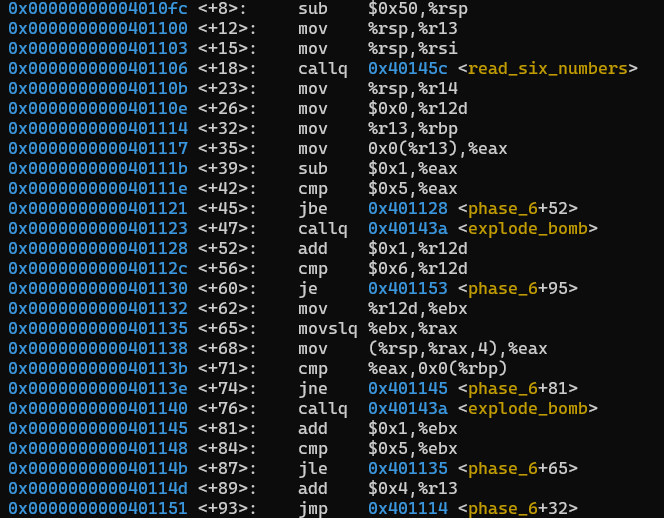
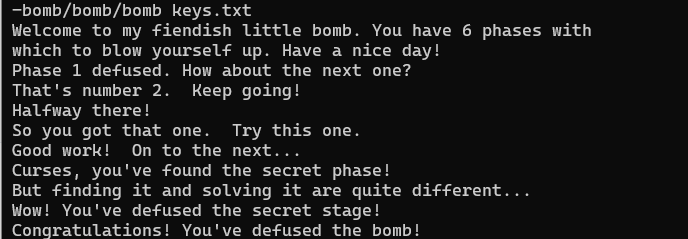
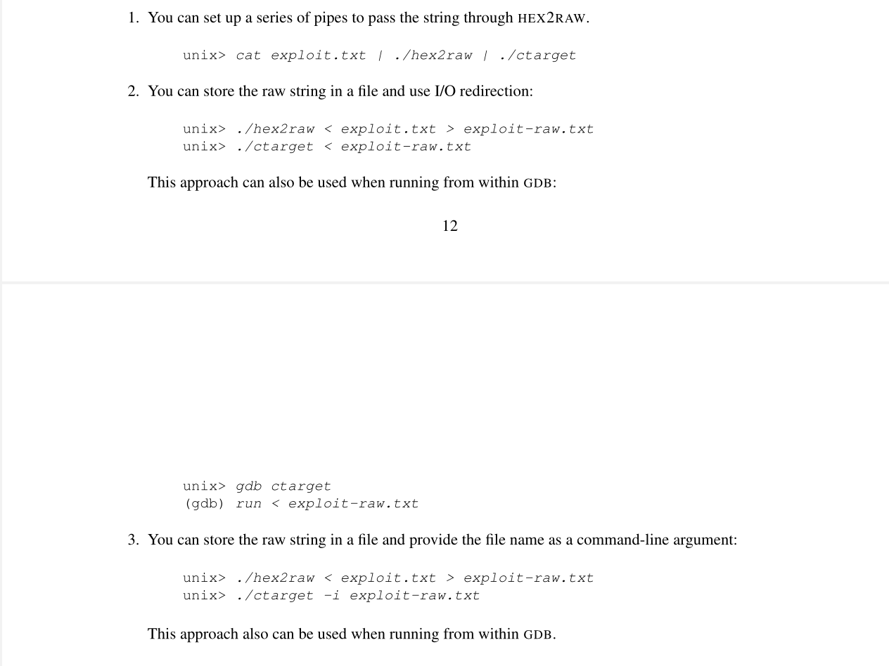
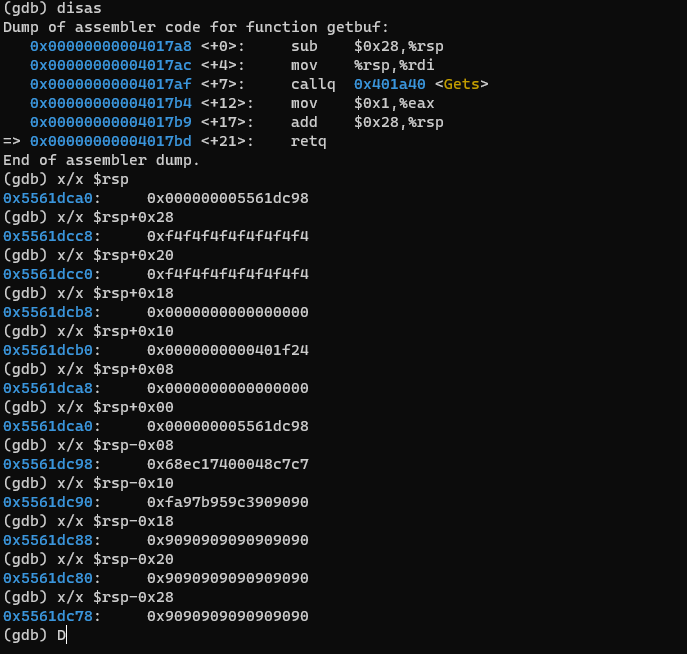

# CS:APP Lab Overview

All CS:APP labs share the following features:

- **Class tested at Carnegie Mellon.** The authors developed and refined the labs over a period of 10 years, on classes of 150-250 students. The course gets high evaluations from the students, who typically cite the labs as the reason they love the course.
- **Automatic testing and evaluation drivers.** Students develop their solution in a C file, which they then link into a C driver program. The driver runs their solution, checks for correctness, and produces a quantitative evaluation of their solution. Students use this feedback to incrementally refine their solutions.
- **Solutions.** Instructors are provided with complete solutions for each Lab.
- **Autograders.** Each lab (with the exception of the Proxy Lab) comes with an Perl autograder that runs the driver program on each student handin file and prints an ASCII grade sheet for each student.
- **Complete lab writeups.** Each lab comes with a complete writeup (in Latex) that provides context, step by step instructions, and an explanation of the evaluation criteria.

Copyright © 2015 Randal E. Bryant and David R. O'Hallaron

# CS:APP3e Lab Assignments

> csapp lab page: http://csapp.cs.cmu.edu/3e/labs.html
>
> csapp home page: http://csapp.cs.cmu.edu/

To untar foo.tar, type `tar xvf foo.tar` to the Unix shell. This will create a directory called "foo" that contains all of the material for the lab.

## Ch2-Data Lab

> 我修改了`Makefile`中指令`-m32`为`-m64`，该引用语句块用于解释原因和问题处理的过程记录。
>
> 由于起初编译无法通过，报错信息如下：
> 
> ```bash
>gcc -O -Wall -m32 -lm -o btest bits.c btest.c decl.c tests.c
> In file included from btest.c:16:
> /usr/include/stdio.h:27:10: fatal error: bits/libc-header-start.h: No such file or directory
> 27 | #include <bits/libc-header-start.h>
>    |          ^~~~~~~~~~~~~~~~~~~~~~~~~~
>    compilation terminated.
>    In file included from decl.c:1:
> /usr/include/stdio.h:27:10: fatal error: bits/libc-header-start.h: No such file or directory
> 27 | #include <bits/libc-header-start.h>
>    |          ^~~~~~~~~~~~~~~~~~~~~~~~~~
>    compilation terminated.
>    In file included from /usr/lib/gcc/x86_64-linux-gnu/9/include/limits.h:194,
>               from /usr/lib/gcc/x86_64-linux-gnu/9/include/syslimits.h:7,
>               from /usr/lib/gcc/x86_64-linux-gnu/9/include/limits.h:34,
>                  from tests.c:3:
>    /usr/include/limits.h:26:10: fatal error: bits/libc-header-start.h: No such file or directory
>    26 | #include <bits/libc-header-start.h>
>    |          ^~~~~~~~~~~~~~~~~~~~~~~~~~
>    compilation terminated.
>    make: *** [Makefile:11: btest] Error 1
> ```
> 
> 在使用`sudo apt install gcc-multilib`安装了对于32-bit程序的依赖库后，编译通过但无法运行，报错提示为：
>
> ```bash
>-bash: ./fshow: cannot execute binary file: Exec format error
> ```
> 
> 使用命令`file fshow`后控制台输出为：
>
> ```bash
>fshow: ELF 32-bit LSB shared object, Intel 80386, version 1 (SYSV), dynamically linked, interpreter /lib/ld-linux.so.2, BuildID[sha1]=997a290081e8b585528c7bcbdab82629817a1cb5, for GNU/Linux 3.2.0, not stripped
> ```
> 
> 目前未知出错原因，于是修改了`Makefile`中`CFLAGS = -O -Wall -m32`中的`-m32`为`-m64`，试图重新编译，提示
>
> ```bash
>make: Nothing to be done for 'all'.
> ```
> 
> 删去此前生成的可执行文件`btest`, `fshow`和`ishow`后重新编译，生成的可执行文件能正常运行。
>
> 此前编译通过时有关于`btest.c`的警告信息，与指定的程序运行32位还是64位环境应该无关，当前信息为`-m64`下编译产生，如下：
>
> ```bash
>gcc -O -Wall -m64 -lm -o btest bits.c btest.c decl.c tests.c
> btest.c: In function ‘test_function’:
> btest.c:332:23: warning: ‘arg_test_range[1]’ may be used uninitialized in this function [-Wmaybe-uninitialized]
> 332 |     if (arg_test_range[1] < 1)
>    |         ~~~~~~~~~~~~~~^~~
>   ```

### Implement

运行`dlc`检查不合法操作符等，不合法会提示，正常时无输出：

```bash
$ ./dlc bits.c
```

运行`btest`检查结果正确性，运行`./btest -f bitXor`，正确时提示如下：

```bash
Score   Rating  Errors  Function
 1      1       0       bitXor
Total points: 1/1
```

出错时，会告知出错的参数，如下：

```bash
Score   Rating  Errors  Function
ERROR: Test bitXor(-2147483648[0x80000000],-2147483648[0x80000000]) failed...
...Gives -1[0xffffffff]. Should be 0[0x0]
Total points: 0/1
```

实验很反直觉，我的做法是，先尽量底层的做出来正确做法，如果有不合法的运算符，之后想办法修改，首先保证正确性。如果无法实现，那就换思路做。

这种相当于是，先拿一个相对较强的条件完成，然后尽量替换原有的强条件来得出相同的结果。

我不确定使用两个逻辑非来制造确定的1或0是否是合适的做法，但我现在有两道题在使用这一策略，相当于是在限制了逻辑比较的前提下刻意使用逻辑非来制造控制的逻辑运算

```c
return !(y ^ (~y + 1)) & !(!y);
```

```c
return !(!(!flag1) & !(!flag2));
```

使用了`~0`来代替`-1`

剩下卡着的题都难顶（

估计是平均一道题两个小时。

> 位运算技巧学习网站 http://graphics.stanford.edu/~seander/bithacks.html#IntegerLogLookup

浮点数

其实虽然浮点数标记的困难增大，但我感觉，当能够使用C语言的各种东西之后，应该会比之前只能使用位运算要轻松多了吧。

魔怔了，为什么我要用位运算来拿符号位？而且注意，无符号是logic shift，right shift for signed is arithmetic shif

确实，当前面难顶的位运算解决结束之后，只要浮点数的基本概念和表示原理清楚，后面的实验做起来确实要顺手很多。

其实这里相当于是很好的理解了，当浮点数转换为整型造成的溢出问题。具体转换情形见代码注释。

浮点数转整数，2的整数次幂，现在就还差个整数转浮点数了，其实就是浮点数转整数倒着来而已，只是会有精读损失，而且不会有溢出的问题。

溢出的充要条件检查，这里要复习教材并整理。

终于，做完了datalab，明天整理整理代码，梳理一下重要的知识点，开始机器语言（其实想先看memory），今晚先睡了。


## Ch3-Bomb Lab

不小心把bomb写坏了（


才意识到，一个寄存器里面不可能存放下一整个字符串，那么字符串是存在哪里的，寄存器里面是什么？**指针**，这样才问题解决了，第一题算是正式折腾出来


有个文件读取的问题，这里读取到的文本格式异常


ASCII是UTF-8的子集，应该不会有问题才对，我推测是windows和linux文件表示的问题。推测正确的，是换行符的问题，linux文件系统的换行符和windows的不同导致


把编码从CRLF改成LF重新保存就可以直接读取了

第二个虽然一个一个搞出来了，但是应该有更直接的做法，从栈里面看，而不是每次读寄存器里面做对比的值。


折腾到现在，终于是把内存里面的值找到了


使用`set`命令来修改内存和寄存器里面的值，这里改为小于等于7的都可以。

```shell
set {int}($rsp+0x8) = 7
```

注意，使用指针来修改的时候要强转，因为默认都是`void*`类型

```shell
set *(int*)($rsp+0xc)=327
```

看得出来，前面几个实验设置出主要是为了让学生熟悉了gdb使用。

第四题，也是读入数值，读入的两个数值，但是要经过计算，这里先在中间修改内存跑出来结果的办法行不通了，要看它运算的逻辑是什么。

phase_defused 解析

从开始进入这个函数，就是做的stack randomization，几条关键的跳转语句和判断语句

```assembly
   0x00000000004015c4 <+0>:     sub    $0x78,%rsp                   // allocate 120 = 8 * 15 byte
   0x00000000004015c8 <+4>:     mov    %fs:0x28,%rax                // 0x68:0x70 = rax
   0x00000000004015d1 <+13>:    mov    %rax,0x68(%rsp)              
   0x00000000004015d6 <+18>:    xor    %eax,%eax                    // rax = 0
   0x00000000004015d8 <+20>:    cmpl   $0x6,0x202181(%rip)          // 0x603760 <num_input_strings>
   0x00000000004015df <+27>:    jne    0x40163f <phase_defused+123> //
   ...
   0x000000000040163f <+123>:   mov    0x68(%rsp),%rax
   0x0000000000401644 <+128>:   xor    %fs:0x28,%rax
   0x000000000040164d <+137>:   je     0x401654 <phase_defused+144>
   0x000000000040164f <+139>:   callq  0x400b30 <__stack_chk_fail@plt>
   0x0000000000401654 <+144>:   add    $0x78,%rsp
   0x0000000000401658 <+148>:   retq
```

现在暂时不清楚这是在做具体的什么检查，但是知道和我要做的基本不相关就是了。

原来是一个secret phase，当做附加题吧，最后一个来解。我是说每次怎么都只执行了其中的一小段，中间必然有个无法成功的判断语句使得无法进行这样的跳转。现在明白了之前试出来的两个数字加一个字符串是什么了。这个附加题可能在每个阶段都可以做，从他读取到的是空字符串可以推断。有点想看看这里是在干什么（

当执行到的时候，按理说是相等的，就是6，但是不知道为什么会跳转到我想的位置之外。我觉得可能需要修改flag的值

> https://stackoverflow.com/questions/12395477/interpreting-eflags-in-ddd

```
bit | sym | name
------------------
  0 |  CF | carry
  1 |  -- | (always 1)
  2 |  PF | parity
  3 |  -- | (always 0)
  4 |  AF | adjust
  5 |  -- | (always 0)
  6 |  ZF | zero
  7 |  SF | sign
  8 |  TF | trap
  9 |  IF | interrupt
 10 |  DF | direction
 11 |  OF | overflow
```

问题出现了，eflags的值是不能被gdb修改的，这可能需要一定的设定。那我的办法就要放在修改之前比较结果的地方。

```shell
set style address foreground cyan
```

明白了，问题出在，如果当前指令没有被执行的时候，`%rip`是指向当前指令的内容的，而当正在执行当前指令的时候，`%rip`是指向下一条指令的内容的，所以要修改下一条指令的内容而不是当前的指令地址对应的内存。


成功了，而且我在输入的时候添加了两个数字和一个字符串，应该能满足输入的要求，等下需要的就是把答案搞出来。

还是不对，输入的多余字符串没有被读入，而且可能之后会影响到第三题。这个隐藏关卡应该不是在这里通过的。

```assembly
0x00000000004015d8 <+20>:    cmpl   $0x6,0x202181(%rip)        # 0x603760 <num_input_strings>
```

在这里被传入用于进行比较的字串是`DrEvil`

```assembly
=> 0x0000000000401604 <+64>:    mov    $0x402622,%esi
   0x0000000000401609 <+69>:    lea    0x10(%rsp),%rdi
   0x000000000040160e <+74>:    callq  0x401338 <strings_not_equal>
```

```
DrEvil
```

这里的返回值应该是用来判断是否正确输入进入隐藏关卡的密码，如果输入正确就会提示：


那么我等出来之后修改返回值的值或者传入两个相同地址的字串就可以了。


按理说，我传入的时候是修改了字符串的地址的，所以不应该出现`%eax`等于0的情况。好吧，我本来是对的，直接传入两个相同地址的字符串这里没有检查问题，但是我在出来之后再修改了`%eax`的值之后就错了。。。


但是我不理解这里是我哪里想错了吗？


先不折腾了，老老实实解题，第四题都还没做。

第四题里面有递归调用，还是需要把原来的C代码还原出来。这道题是个多解题，目前猜到的答案有0,1,7，虽然还原了C代码，但是还是不完全能理解这是在做什么，当然，现在能够通过就行，那接下来等做完之后再把答案找全。

> 可以暴力跑。。。小于等于14，但是这样没有考虑负数
>
> 0,1,3,7

第五题最核心的就是这里操作字符的做法了


需要明确rdx,edx,dl都是同一个寄存器的不同部分，但实际上都是只在操作那一个字符，在经过按位与`0xf`之后，由此得出的地址偏移量来从`"maduiersnfotvbyl"`字符串中取一个字符作为答案`flyers`的组成部分，我猜，但大致思路应该是对的。

好了，看到最后在`0x16($rsp)`这里添加了一个0，就知道我猜对了，传参答案是`flyers`，现在只需要计算一下我之前需要填入的字符串是什么就好了。

最后得到的可选结果如下，每行任选一个字符组成即可：


除此以外，隐藏关卡应该也不是在这里打开，这里要检查字符串长度，没有多余的位置拿给我输入。事实上，第4题和5题都比较顺畅，解决速度比前三题快多了，当然这归功于gdb的使用相对熟悉了，读不复杂的汇编也能很快理解了。

最后一题了。


```assembly
Dump of assembler code for function phase_6:
=> 0x00000000004010f4 <+0>:     push   %r14
   0x00000000004010f6 <+2>:     push   %r13
   0x00000000004010f8 <+4>:     push   %r12
   0x00000000004010fa <+6>:     push   %rbp
   0x00000000004010fb <+7>:     push   %rbx
   0x00000000004010fc <+8>:     sub    $0x50,%rsp
   0x0000000000401100 <+12>:    mov    %rsp,%r13
   0x0000000000401103 <+15>:    mov    %rsp,%rsi
   0x0000000000401106 <+18>:    callq  0x40145c <read_six_numbers>
   0x000000000040110b <+23>:    mov    %rsp,%r14
   0x000000000040110e <+26>:    mov    $0x0,%r12d
   0x0000000000401114 <+32>:    mov    %r13,%rbp
   0x0000000000401117 <+35>:    mov    0x0(%r13),%eax
   0x000000000040111b <+39>:    sub    $0x1,%eax
   0x000000000040111e <+42>:    cmp    $0x5,%eax
   0x0000000000401121 <+45>:    jbe    0x401128 <phase_6+52>
   0x0000000000401123 <+47>:    callq  0x40143a <explode_bomb>
   0x0000000000401128 <+52>:    add    $0x1,%r12d
   0x000000000040112c <+56>:    cmp    $0x6,%r12d
   0x0000000000401130 <+60>:    je     0x401153 <phase_6+95>
   0x0000000000401132 <+62>:    mov    %r12d,%ebx
   0x0000000000401135 <+65>:    movslq %ebx,%rax
   0x0000000000401138 <+68>:    mov    (%rsp,%rax,4),%eax
   0x000000000040113b <+71>:    cmp    %eax,0x0(%rbp)
   0x000000000040113e <+74>:    jne    0x401145 <phase_6+81>
   0x0000000000401140 <+76>:    callq  0x40143a <explode_bomb>
   0x0000000000401145 <+81>:    add    $0x1,%ebx
   0x0000000000401148 <+84>:    cmp    $0x5,%ebx
   0x000000000040114b <+87>:    jle    0x401135 <phase_6+65>
   0x000000000040114d <+89>:    add    $0x4,%r13
   0x0000000000401151 <+93>:    jmp    0x401114 <phase_6+32>
   0x0000000000401153 <+95>:    lea    0x18(%rsp),%rsi
   0x0000000000401158 <+100>:   mov    %r14,%rax
   0x000000000040115b <+103>:   mov    $0x7,%ecx
   0x0000000000401160 <+108>:   mov    %ecx,%edx
   0x0000000000401162 <+110>:   sub    (%rax),%edx
   0x0000000000401164 <+112>:   mov    %edx,(%rax)
   0x0000000000401166 <+114>:   add    $0x4,%rax
   0x000000000040116a <+118>:   cmp    %rsi,%rax
   0x000000000040116d <+121>:   jne    0x401160 <phase_6+108>
   0x000000000040116f <+123>:   mov    $0x0,%esi
   0x0000000000401174 <+128>:   jmp    0x401197 <phase_6+163>
   0x0000000000401176 <+130>:   mov    0x8(%rdx),%rdx
   0x000000000040117a <+134>:   add    $0x1,%eax
   0x000000000040117d <+137>:   cmp    %ecx,%eax
   0x000000000040117f <+139>:   jne    0x401176 <phase_6+130>
--Type <RET> for more, q to quit, c to continue without paging--
   0x0000000000401181 <+141>:   jmp    0x401188 <phase_6+148>
   0x0000000000401183 <+143>:   mov    $0x6032d0,%edx
   0x0000000000401188 <+148>:   mov    %rdx,0x20(%rsp,%rsi,2)
   0x000000000040118d <+153>:   add    $0x4,%rsi
   0x0000000000401191 <+157>:   cmp    $0x18,%rsi
   0x0000000000401195 <+161>:   je     0x4011ab <phase_6+183>
   0x0000000000401197 <+163>:   mov    (%rsp,%rsi,1),%ecx
   0x000000000040119a <+166>:   cmp    $0x1,%ecx
   0x000000000040119d <+169>:   jle    0x401183 <phase_6+143>
   0x000000000040119f <+171>:   mov    $0x1,%eax
   0x00000000004011a4 <+176>:   mov    $0x6032d0,%edx
   0x00000000004011a9 <+181>:   jmp    0x401176 <phase_6+130>
   0x00000000004011ab <+183>:   mov    0x20(%rsp),%rbx
   0x00000000004011b0 <+188>:   lea    0x28(%rsp),%rax
   0x00000000004011b5 <+193>:   lea    0x50(%rsp),%rsi
   0x00000000004011ba <+198>:   mov    %rbx,%rcx
   0x00000000004011bd <+201>:   mov    (%rax),%rdx
   0x00000000004011c0 <+204>:   mov    %rdx,0x8(%rcx)
   0x00000000004011c4 <+208>:   add    $0x8,%rax
   0x00000000004011c8 <+212>:   cmp    %rsi,%rax
   0x00000000004011cb <+215>:   je     0x4011d2 <phase_6+222>
   0x00000000004011cd <+217>:   mov    %rdx,%rcx
   0x00000000004011d0 <+220>:   jmp    0x4011bd <phase_6+201>
   0x00000000004011d2 <+222>:   movq   $0x0,0x8(%rdx)
   0x00000000004011da <+230>:   mov    $0x5,%ebp
   0x00000000004011df <+235>:   mov    0x8(%rbx),%rax
   0x00000000004011e3 <+239>:   mov    (%rax),%eax
   0x00000000004011e5 <+241>:   cmp    %eax,(%rbx)
   0x00000000004011e7 <+243>:   jge    0x4011ee <phase_6+250>
   0x00000000004011e9 <+245>:   callq  0x40143a <explode_bomb>
   0x00000000004011ee <+250>:   mov    0x8(%rbx),%rbx
   0x00000000004011f2 <+254>:   sub    $0x1,%ebp
   0x00000000004011f5 <+257>:   jne    0x4011df <phase_6+235>
   0x00000000004011f7 <+259>:   add    $0x50,%rsp
   0x00000000004011fb <+263>:   pop    %rbx
   0x00000000004011fc <+264>:   pop    %rbp
   0x00000000004011fd <+265>:   pop    %r12
   0x00000000004011ff <+267>:   pop    %r13
   0x0000000000401201 <+269>:   pop    %r14
   0x0000000000401203 <+271>:   retq
End of assembler dump.
```

艹，怎么这么长，突然传来一股浓浓的嘲讽味，量变引起质变是吧（


虽然必定是需要逐行逐行执行代码来看它在干什么的，刚来应该还是要集中把它的大体框架猜出来。



通过分析，这一段代码，是在检查每一个数值是否和后面的所有数值不同，并且每个数都要小于等于6，每个数都不能是0，因为是无符号整型在比较大小。换句话讲，到这里为止，满足输入的所有情况是[123456]的全排列。这时候其实已经可以开始爆破了，但是为了解题，我还是选择思考正解，因为逻辑看起来并不复杂。


这一段代码是把原来读到内存里面的那六个数`[x0 x1 ... x5]`处理一下，得到`[7-x0 7-x1 ... 7-x5]`，`%rsi`是用来检查指针越界的。

破防了，后面乱七八糟的跳转让我不能推断他在做什么，我只看到了一个在处理1的时候的跳转流程，但是如果顺序不对的话是不能得到正确结果的。

我觉得主要是我在不停的切换计算的顺序，但也有一部分原因是我不能理解中间的计算过程是在做什么。观察到了一个很奇怪的信息，`0x6032d0`这个地址或者什么东西被用了几次，但是我没能正确的读取这个地址的内容。

文件末要加换行符。

记录一下几个我觉得有问题的地方，strings打出来的

```
0000000000401204 g     F .text    000000000000003e              fun7
...
00000000006032f0 g     O .data    0000000000000010              node3
0000000000000000       F *UND*    0000000000000000              read@@GLIBC_2.2.5
0000000000000000       F *UND*    0000000000000000              __libc_start_main@@GLIBC_2.2.5
0000000000000000       F *UND*    0000000000000000              fgets@@GLIBC_2.2.5
000000000040143a g     F .text    0000000000000022              explode_bomb
00000000006032d0 g     O .data    0000000000000010              node1
00000000006030e0 g       .data    0000000000000000              __data_start
0000000000000000       F *UND*    0000000000000000              signal@@GLIBC_2.2.5
0000000000000000       F *UND*    0000000000000000              gethostbyname@@GLIBC_2.2.5
0000000000603310 g     O .data    0000000000000010              node5
...
00000000006032e0 g     O .data    0000000000000010              node2
0000000000603300 g     O .data    0000000000000010              node4
0000000000000000       F *UND*    0000000000000000              sleep@@GLIBC_2.2.5
0000000000603320 g     O .data    0000000000000010              node6
```

secret_phase我已经知道了答案，只是目前还不知道如何正常进入，这个涉及到指令取值，我怎么感觉要代码注入？

fun7有点奇怪，第七个函数怎么来的？也许和这个函数的地址有关系。先到这里，等下休息会再继续想。或者可以先把答案爆破出来，720种对于计算机来说真的太少了。

还是倾向于思考正解，不过学习爆破的代码写法也是很重要的，有限的枚举是很自然的做法。

从node1到node6，是我自然的想法，那么我有理由认为我第一个是1猜的是对的。

艹，猜的对个p。。。昏沉发蒙的大脑已经放弃思考他的逻辑了，最终靠半小时写了个暴力枚举出来答案。


先这样了，过于疲倦。等下把secret_phase进入的办法找出来，这个应该简单多了。

```assembly
x/x 0x202181+0x00000000004015df
0x603760 <num_input_strings>:   0x00000001
```

在不同阶段进入的时候，这一行的取值从1变化到6，这么看来，是只有在最后阶段才能进入

```
DrEvil
```


一个没有用过的函数`strtol()`，作用是`converting string to long integer`，根据基k的取值得出k-进制数（所给字符串）的10进制数值。

> https://www.cplusplus.com/reference/cstdlib/strtol/

函数原型为

```c
long int strtol (const char* str, char** endptr, int base);
```

对应到汇编代码的参数就是，`strtol($rax, $rsi, $rdx)`，这里只读取一个字符串并且直接转为数值，应该就是只读入一个数。


之前注意到的`fun7`

通过指针域的特征以及一个意外的提示注意到了，这是个二叉树，结点用n1开始标记。但是用到的结点只有15个。还有就是，这个递归调用有点像构造或者遍历之类的。由于没有动态内存分配，推测可能已经是构造好了的（这一点可以从数值已经在结点中存在推断）

好像是个查询操作，类似二叉搜索树。妙啊，懂了！访问左子树，回来的时候\*2，访问右子树，回来的时候\*2+1，那么就要左走一步再右走一步，返回的时候先变成1，再翻倍成2。也明白了，奇怪的编号第一个数字是指层数。

```
0000000000603190 g     O .data	0000000000000018              n31
0000000000603170 g     O .data	0000000000000018              n33
0000000000603230 g     O .data	0000000000000018              n44
0000000000603290 g     O .data	0000000000000018              n46
0000000000603250 g     O .data	0000000000000018              n42
00000000006032b0 g     O .data	0000000000000018              n48
0000000000603130 g     O .data	0000000000000018              n22
00000000006030f0 g     O .data	0000000000000018              n1
00000000006031b0 g     O .data	0000000000000018              n34
0000000000603150 g     O .data	0000000000000018              n32
0000000000603210 g     O .data	0000000000000018              n47
0000000000603270 g     O .data	0000000000000018              n43
00000000006031f0 g     O .data	0000000000000018              n41
00000000006031d0 g     O .data	0000000000000018              n45
0000000000603110 g     O .data	0000000000000018              n21
```

终于结束了，虽然phase_6还需要之后再想想它的逻辑，不过有了答案应该能正向走几遍看懂它在干什么。phase_4应该也能想出来正解了，两个人脑反汇编出来的C代码感觉结构挺相似的。



## Ch3-Attack Lab

### CATTACK

无法运行`cattack`，虽然看到了这个说升级到wsl2就可以的博客，还是准备在虚拟机上跑。

https://blog.csdn.net/zstuyyyyccccbbbb/article/details/119140914

因为原来的卡，重开了一个Ubuntu，但是发现还是太卡了，9G的内存8个处理器，用free看也就不到2个G，无法理解的卡顿，现在先暂时放弃折腾虚拟机，我觉得是VirtualBox的锅。

然后按照博客提示升级了wsl，问题解决。

按理说第一个题本来是比较简单的，但是没有直接使用管道而是在GDB中复制粘贴导致了字符发生变化，得到的结果不符合预期，折腾几次之后感觉问题出在字符复制粘贴那里。


之后改用管道得到正确结果


或者，另一种合适的做法是，将生成的raw文件单独保存（视为二进制文件，避免文本赋值粘贴导致错误）

记录一下writeup里面给的小技巧




结合使用`GCC`和`OBJDUMP`，可以从汇编到机器指令，然后再通过反编译得到指令和对应的汇编。这样甚至可以通过写C代码来达到相应目的。


然后再加上这接下来的一系列操作，完全可以做到自动化的进行了。

> This string can then be passed through `HEX2RAW` to generate an input string for the target programs.. Alter-
> natively, you can edit `example.d` to omit **extraneous** values and to contain C-style comments for readability,
> yielding:
>
> ```assembly
> 68 ef cd ab 00  /* pushq $0xabcdef */
> 48 83 c0 11     /* add $0x11,%rax */
> 89 c2           /* mov %eax,%edx */
> ```
>
> This is also a valid input you can pass through `HEX2RAW` before sending to one of the target programs.

也就是说，这种攻击的流程是：

1. 编写汇编代码
2. `gcc -c xx.s`编译得到`xx.o`文件
3. `objdump -d xx.o`反编译得到汇编和机器指令逐一对应的`xx.d`文件
4. 删去`xx.d`文件中无用的部分，保留机器指令并将汇编指令改为注释
5. 将修改过后的`xx.d`文件丢入`hex2raw`得到注入代码文件，`vscode`将其识别为二进制文件，即可执行文件

这里提到了，利用return必然会执行栈顶代码的特点。但是目前，我只有利用buffer进行代码覆盖这一种办法，我要怎么写？

我大概有个推测，我能够注入代码的地方就只有从通过gets这里读入字符串的地方，再加上一部分返回地址上面的栈空间，除此外，我没有其他地方可以直接注入代码（我猜）。利用栈释放的时候里面的值不会被修改而只是指针在增减，可以把代码写在下面被释放的位置（但这一点是我不完全确定的），或者也可以继续覆盖掉栈上面的空间，当然，都是利用return这一跳转的特点。

本来我还在想，问题是栈的位置每次运行的时候都在变化，我怎么要怎么写相对定位的问题，突然想起来，这道题的代码似乎就是有栈的位置不变的特征，那么问题就解决了，回去看writeup也确实是这样的。

> This program is set up in a way that the stack positions will be consistent from one run to the next and so that data on the stack can be treated as executable code. These features make the program vulnerable to attacks where the exploit strings contain the byte encodings of executable code.

所以才说，要在一台近乎相同的Linux机器上面测试代码，否则会发生栈位置不同而无法成功的问题（但好像其实栈的位置不同也不是不行，攻击也不需要非得在同一个位置进行，只要它检测溢出异常之前能执行就成功了。）

我第一题也应该多覆盖几位，00还不够多，写满16位才能确保地址无误。

这种做法很反常啊，只能倒着填代码，因为写到栈里面的顺序和我读取的顺序是反的，我感觉答案不应该是这样的吧。但如果是利用栈这个位置的话，必然会存在这样的问题啊。但我之前在写第一题的地址的时候又没有出现这个问题，感觉有点怪怪的，因为一次读取的时候是把整个8 bytes一起读取了作为一个数值整体，`little-endian`也符合正常的低位对齐地址低位的习惯，所以应该是没有问题的。

汇编里面那种反直觉的写法应该是设定的原因。

> 这里有点问题，我的代码直接覆盖在了栈下面不该存在的位置，可能和我写的push有关，这里应该要涉及一些栈操作，需要仔细想想。第一次写这类的注入代码，很多方面都考虑的不完善。

我上面这句的说法是错的，按理说我的做法已经是合适的方式了，如果在非栈空间执行代码是可以被允许的话。



我查了一下，堆栈溢出的攻击就是利用这一性质的，我要找一下问题出在哪里，不排除是没有被分配的栈空间被认为是不可访问的位置。


阅读了一下代码段部分的指令表示，感觉可能是我刻意制造的逆序代码是错误的，现在只是粗略的有个这种的感觉，明天细看。

问题解决了，以`little-endian`的规则，所有的格式都不是反直觉的，都是合理的。指令就是从低位读取到高位进行执行的，所以看起来地址的值才是不符合直接阅读的习惯，但这是满足了低位地址对应低位数值位的习惯。机器码指令具有无公共前缀的特点，这意味着不会出现歧义，那么从低位逐字节的读取就不会存在问题。现在了解了这一点，可以开始重新规划一下代码了。

注意到了原来代码的问题所在，机器指令是从低位到高位逐个字节读取的，所以我一开始指令的顺序就错了。注入的攻击指令有13个bytes，注入的地址有8个bytes，总共48个bytes位置需要被覆盖，用来填充的`nop`就是27bytes。希望一次成功。

返回地址忘记改了。。。而且也忽略了`little-endian`的写法

第二题pass


这三道题真的是层层递进。。。相当于就是当你什么都不会一步一步的手把手教怎么写，这题更是提示了你之前要是用了buffer位置的栈空间，这回不得行了，因为中间一段会被后面的数据覆盖掉。


那么这里我要避免我的指令代码被覆盖掉就要更仔细的规划代码插入的地方，这是buffer overflow的题，所以多半还是在buffer里面什么地方插入代码，只是我的代码要避开那段被覆盖的位置（所以就显然不能像我之前那样去写了）。我感觉，最好还是不要破坏上面没有被设为buffer的栈空间，如果碰到那个`%fs:xx`分配的位置就很尴尬了，直接报错。有问题，好像还真得往上面写，否则位置可能会不够，不过还是得先计算一下再说。

最后选择的方式是，从下面一开始就是可执行的代码段，然后中间可能留一些`nop`的位置让后面分配栈的时候来填充。但最好尽量往后填吧。

> 记牢了，python来查看字符`c`对应的ascii是`ord(c)`，相反，是`chr(ascii)`

还是13 bytes的指令。

直接写的代码好像出了点问题，导致我没能传入成功字符串。


检查了一下栈指针的位置，发现就是调用函数的时候push操作把之前写字符串位置的东西给覆盖掉了差了5个bytes，换一下代码和字符串的地址应该就行。

其实换了之后还是不行，因为检查了一下`hexmatch`函数，里面有个骚操作是连续的3个push，再加上return address占掉的和在`touch`里面`push    %rbx`占掉的，字符串末尾的零已经被覆盖掉了。然后再加上`mov    %fs:0x28,%rax`这句导致的`mov    %rax,0x78(%rsp)`，直接就把原来字符串位置的东西写没了。


最后还是选择在上面的栈空间进行字符串的保存，然后就成功了。


这里还学到了一个小技巧就是在尚不确定的位置或者要修改的位置，为了不对原来的代码结构进行修改和导致计算出来的地址出现错误，用`nop`来替代原来指令的位置，因为这样不会影响指令的执行。

小结一下，这三道题完全是层层递进的让你了解buffer overflow是怎样被攻击的，虽然做完之后我能意识到，这三道题完全可以都用第三题的思路来解决，但不知道是出题人设计的太好了还是怎样，或者他出题的时候真的全面的计算到了初学者下意识会如何设计攻击，以至于每一次上一道题的方式都不能直接被使用，一个是要添加指令码，一个是后续函数调用时栈的使用导致原定字符串无效，出题人似乎真的想到了我会琢磨着想把代码放在原来分配的栈里面（不论我是否是抱有尽可能不要动上面可能被保护的代码这种念头），然后第二题就让我这么做，但是第三题又恰到好处的把我第二题的方法切断一半，尝试了两种注入代码的思路最终不得不尝试着把代码写在返回地址的上面，然后成功PASS。更精巧的是，出题人专门强调了，第三题会把原来栈里面的空间覆盖写入数据，虽然我尝试着尽可能的绕开了那40个字节里可能被覆盖的位置，依然没能成功。

### RATTACK

我没有想到的是，这里确实会教你在当今应对buffer overflow vulnerabilities上，已经相当有防护能力的三种解决策略是如何被攻破的。

主教材里面讲了三种方法：

* stack randomization, namely the mostly called address-space layout randomization (ASLR)
* stack corruption detection
* limiting code executable regions

上面`CTARGET`的习题只有第二条"corruption detection"被利用到了（还直接把我字符串给刚好覆盖完），剩下两个我看起来最有效的策略都没有被使用，而这道题就会教你如何在有着三重防护的基础上进行攻击。

同时，刚刚想起来的是，这个完整的攻击代码注入工作都是没有让我进行的，也就是说我甚至没有能力在它的机器码上面进行修改，以使得执行相应的代码。等一下，要是我有它的机器码，我不是可以直接编辑然后运行就成了，为什么要做这些奇奇怪怪看似多余的操作，除非攻击是在远程的机器上进行的，甚至攻击本身也是为了调用已知的系统进程来帮助自己执行指令，并不需要注入完整的机器码函数（这也说不定）。这个问题先留在这里，等以后想起再解答吧。

> Todo: 问题保留。

至于新的这个实验，首先我不明白这个名字是什么意思。而且到目前为止，我都只知道我能注入代码的位置就是本来用于读入字符串的位置，但仅仅这样的水平应该是不足以完成这份任务的。

> Segmentation fault，这种问题我遇到好几次了，造成的原因有一部分是不可执行的代码段导致的（错误的机器指令）

The position of injected code can vary from one run to another, due to the randomization of stack. But the existing code addresses are persistent, which must be exactly constants for process to load it into memory and can never be altered in any way. Thus, a readily method can be devised to incorporate this feature, and it can make attack the program with the protection mentioned above possible. And that is **Return-Oriented Programming (ROP)**.

在处理这道题上，我无法得知栈中数据的绝对地址，唯一可行的利用方案就是利用`%rsp`的值。和`phase2`完全一致的部分是，我可以通过buffer overflow来往返回地址那里写值。这道题没有给`push`的编码，应该是用不到，这可能和我期望有些不符，那么这题应该就是要用不止那48 bytes我之前已经尝试使用的空间，可能我要把位置放在整个64 bytes栈上。当在`getbuf`函数里面返回的时候，这里总共只有0x18 bytes是可以预先填入数据的，含第一次的跳转地址。

> 我可能已经意识到了，我在处理这类无从下手的问题时，注意力会不自觉的飘离

可用的指令有`movq`, `movl`, `popq`, `andb`, `orb`, `cmpb`, `testb`。把表截下来放下面：


重新理一下思路。

这道题可供使用的指令中没有`add`和`sub`这类，也就是说，我是不能通过`mov`将栈中的值移动到寄存器的，只能使用`pop`。而在汇编代码中找机器指令，发现并没有期望的`5f`，所以必须借用过渡的寄存器。

用` 5[8-9a-f] `查找farm只有指令`58`，所以第一个指令是`popq %rax [58]`。很显然由于只需要用2个指令，第二个指令只能是`movq %rax, %rdi [48 89 c7]`。查找对应的指令，忽略不计多余的`90`，然后得到两条指令的地址。

```
+-----------------+
|  run-time stack |
+-----------------+
|   ret addr 3    |  # <touch2>
|   ret addr 2    |  # 0x4019c5: movq %rax, %rdi [48 89 c7]
|    pop val      |  # cookie 0x59b997fa
|   ret addr 1    |  # 0x4019ab: popq %rax [58]
+-----------------+
|  40-byte nops   |
+-----------------+
```

逻辑想清楚了之后，一次成功


接下来是最后一题了，我感觉应该差不多时间，之前主要是由于没想清楚一直在走神。

先复习一下一些正则表达式匹配的规则：

> 整理自来源 https://www.liaoxuefeng.com/wiki/1252599548343744/1304066080636961

重复匹配

* `[0-9]*`	匹配任意数目个数字（可以没有数字）
* `[0-9]+`	匹配至少0个数字，无上界
* `[0-9]?`	匹配0个或1个数字
* `[0-9]{m}`	匹配m个数字
* `[0-9]{m,n}`	匹配至少m、至多n个数字
* `[0-9]{m,}`	匹配至少m个数字，无上界

或匹配及括号（以下为复制粘贴）

* `java|php|go`

* `learn\sjava|learn\sphp|learn\sgo`
* `learn\\s(java|php|go)`

刚刚发现我遗漏了一个很重要的信息，"functional `nop` instructions"。我本来还在奇怪这些指令有什么用，然后往后翻writeup才发现这些指令就是为了扩展可以使用的`mov`类型指令的范围，之前整理的又要小小的废弃（也不是，就是`movl`里面又有两句可用了）。

`[^4][^8] 89 [c-f][0-f] (90 |(20|08|38|84)\s(c0|c9|d2|db))`这条模式串是有问题的

应该实现这条模式串的效果`([^4][^8]|[4][^8]|[^4][8]) 89 [c-f][0-f] (\s|90\s{2,}|(20|08|38|84)\s(c0|c9|d2|db))`

这道题解决后有重新理一下匹配的格式

> Todo: 字符串匹配，筛选可用的代码，对同一行进行多次检查

```assembly
(gdb) disas
Dump of assembler code for function getbuf:
   0x00000000004017a8 <+0>:     sub    $0x28,%rsp
   0x00000000004017ac <+4>:     mov    %rsp,%rdi
   0x00000000004017af <+7>:     callq  0x401b60 <Gets>
   0x00000000004017b4 <+12>:    mov    $0x1,%eax
   0x00000000004017b9 <+17>:    add    $0x28,%rsp
=> 0x00000000004017bd <+21>:    retq
End of assembler dump.
(gdb) stepi
...

Breakpoint 4, 0x00000000004019ab in addval_219 ()
(gdb) x/x $rsp
0x7fffffff2d60: 0x00000048
(gdb) stepi
0x00000000004019ac in addval_219 ()
(gdb) x/x $rsp
0x7fffffff2d68: 0x004019dd
(gdb) stepi
0x00000000004019ad in addval_219 ()
(gdb) x/x $rsp
0x7fffffff2d68: 0x004019dd
(gdb) stepi
...
Breakpoint 4, 0x00000000004019ab in addval_219 ()
(gdb) x/x $rsp
0x7fffffff2d90: 0x004018fa
(gdb) stepi
0x00000000004019ac in addval_219 ()
(gdb) x/x $rsp
0x7fffffff2d98: 0x39623935
(gdb)
```

检查出问题，最后通过了


