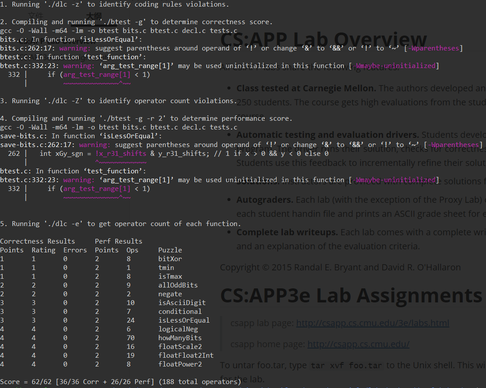

# CS:APP Lab Overview

All CS:APP labs share the following features:

- **Class tested at Carnegie Mellon.** The authors developed and refined the labs over a period of 10 years, on classes of 150-250 students. The course gets high evaluations from the students, who typically cite the labs as the reason they love the course.
- **Automatic testing and evaluation drivers.** Students develop their solution in a C file, which they then link into a C driver program. The driver runs their solution, checks for correctness, and produces a quantitative evaluation of their solution. Students use this feedback to incrementally refine their solutions.
- **Solutions.** Instructors are provided with complete solutions for each Lab.
- **Autograders.** Each lab (with the exception of the Proxy Lab) comes with an Perl autograder that runs the driver program on each student handin file and prints an ASCII grade sheet for each student.
- **Complete lab writeups.** Each lab comes with a complete writeup (in Latex) that provides context, step by step instructions, and an explanation of the evaluation criteria.

Copyright © 2015 Randal E. Bryant and David R. O'Hallaron

# CS:APP3e Lab Assignments

> csapp lab page: http://csapp.cs.cmu.edu/3e/labs.html
>
> csapp home page: http://csapp.cs.cmu.edu/

To untar foo.tar, type `tar xvf foo.tar` to the Unix shell. This will create a directory called "foo" that contains all of the material for the lab.

## 1-Data Lab
> 我修改了`Makefile`中指令`-m32`为`-m64`，该引用语句块用于解释原因和问题处理的过程记录。
>
> 由于起初编译无法通过，报错信息如下：
> 
> ```bash
>gcc -O -Wall -m32 -lm -o btest bits.c btest.c decl.c tests.c
> In file included from btest.c:16:
> /usr/include/stdio.h:27:10: fatal error: bits/libc-header-start.h: No such file or directory
> 27 | #include <bits/libc-header-start.h>
>    |          ^~~~~~~~~~~~~~~~~~~~~~~~~~
>    compilation terminated.
>    In file included from decl.c:1:
> /usr/include/stdio.h:27:10: fatal error: bits/libc-header-start.h: No such file or directory
> 27 | #include <bits/libc-header-start.h>
>    |          ^~~~~~~~~~~~~~~~~~~~~~~~~~
>    compilation terminated.
>    In file included from /usr/lib/gcc/x86_64-linux-gnu/9/include/limits.h:194,
>               from /usr/lib/gcc/x86_64-linux-gnu/9/include/syslimits.h:7,
>               from /usr/lib/gcc/x86_64-linux-gnu/9/include/limits.h:34,
>                  from tests.c:3:
>    /usr/include/limits.h:26:10: fatal error: bits/libc-header-start.h: No such file or directory
>    26 | #include <bits/libc-header-start.h>
>    |          ^~~~~~~~~~~~~~~~~~~~~~~~~~
>    compilation terminated.
>    make: *** [Makefile:11: btest] Error 1
> ```
> 
> 在使用`sudo apt install gcc-multilib`安装了对于32-bit程序的依赖库后，编译通过但无法运行，报错提示为：
>
> ```bash
>-bash: ./fshow: cannot execute binary file: Exec format error
> ```
> 
> 使用命令`file fshow`后控制台输出为：
>
> ```bash
>fshow: ELF 32-bit LSB shared object, Intel 80386, version 1 (SYSV), dynamically linked, interpreter /lib/ld-linux.so.2, BuildID[sha1]=997a290081e8b585528c7bcbdab82629817a1cb5, for GNU/Linux 3.2.0, not stripped
> ```
> 
> 目前未知出错原因，于是修改了`Makefile`中`CFLAGS = -O -Wall -m32`中的`-m32`为`-m64`，试图重新编译，提示
>
> ```bash
>make: Nothing to be done for 'all'.
> ```
> 
> 删去此前生成的可执行文件`btest`, `fshow`和`ishow`后重新编译，生成的可执行文件能正常运行。
>
> 此前编译通过时有关于`btest.c`的警告信息，与指定的程序运行32位还是64位环境应该无关，当前信息为`-m64`下编译产生，如下：
>
> ```bash
>gcc -O -Wall -m64 -lm -o btest bits.c btest.c decl.c tests.c
> btest.c: In function ‘test_function’:
> btest.c:332:23: warning: ‘arg_test_range[1]’ may be used uninitialized in this function [-Wmaybe-uninitialized]
> 332 |     if (arg_test_range[1] < 1)
>    |         ~~~~~~~~~~~~~~^~~
>   ```

### Implement

运行`dlc`检查不合法操作符等，不合法会提示，正常时无输出：

```bash
$ ./dlc bits.c
```

运行`btest`检查结果正确性，运行`./btest -f bitXor`，正确时提示如下：

```bash
Score   Rating  Errors  Function
 1      1       0       bitXor
Total points: 1/1
```

出错时，会告知出错的参数，如下：

```bash
Score   Rating  Errors  Function
ERROR: Test bitXor(-2147483648[0x80000000],-2147483648[0x80000000]) failed...
...Gives -1[0xffffffff]. Should be 0[0x0]
Total points: 0/1
```

实验很反直觉，我的做法是，先尽量底层的做出来正确做法，如果有不合法的运算符，之后想办法修改，首先保证正确性。如果无法实现，那就换思路做。

这种相当于是，先拿一个相对较强的条件完成，然后尽量替换原有的强条件来得出相同的结果。

我不确定使用两个逻辑非来制造确定的1或0是否是合适的做法，但我现在有两道题在使用这一策略，相当于是在限制了逻辑比较的前提下刻意使用逻辑非来制造控制的逻辑运算

```c
return !(y ^ (~y + 1)) & !(!y);
```

```c
return !(!(!flag1) & !(!flag2));
```

使用了`~0`来代替`-1`

剩下卡着的题都难顶（

估计是平均一道题两个小时。

> 位运算技巧学习网站 http://graphics.stanford.edu/~seander/bithacks.html#IntegerLogLookup

浮点数

其实虽然浮点数标记的困难增大，但我感觉，当能够使用C语言的各种东西之后，应该会比之前只能使用位运算要轻松多了吧。

魔怔了，为什么我要用位运算来拿符号位？而且注意，无符号是logic shift，right shift for signed is arithmetic shif

确实，当前面难顶的位运算解决结束之后，只要浮点数的基本概念和表示原理清楚，后面的实验做起来确实要顺手很多。

其实这里相当于是很好的理解了，当浮点数转换为整型造成的溢出问题。具体转换情形见代码注释。

浮点数转整数，2的整数次幂，现在就还差个整数转浮点数了，其实就是浮点数转整数倒着来而已，只是会有精读损失，而且不会有溢出的问题。

溢出的充要条件检查，这里要复习教材并整理。

终于，做完了datalab，明天整理整理代码，梳理一下重要的知识点，开始机器语言（其实想先看memory），今晚先睡了。


