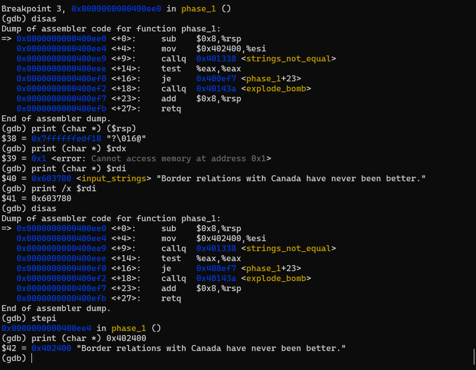
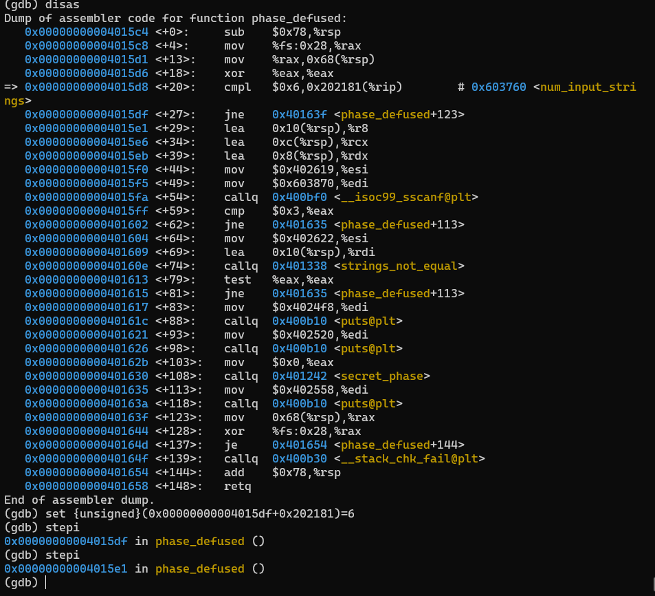
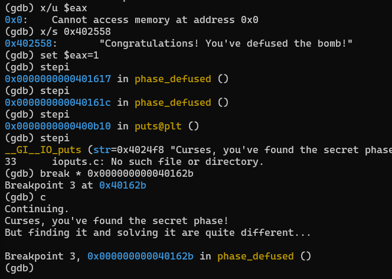
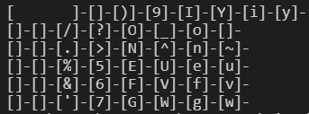
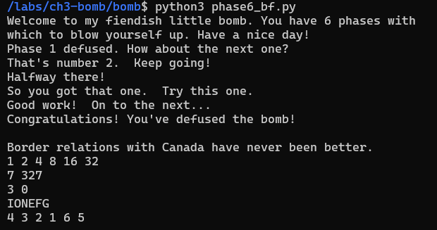
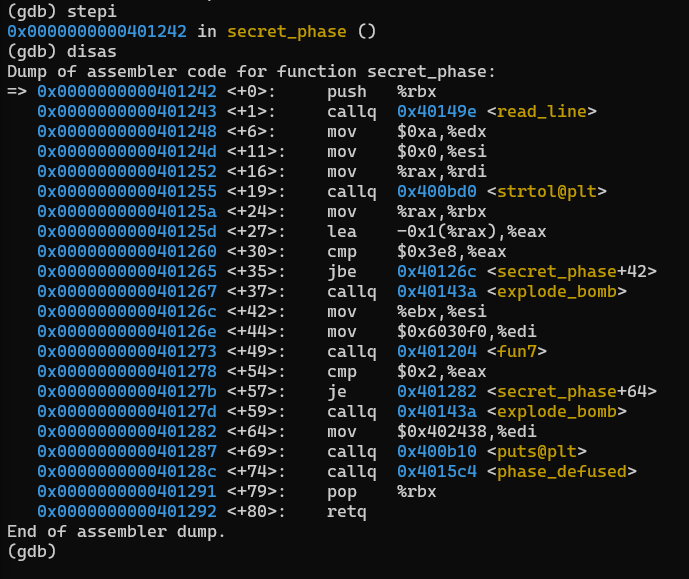
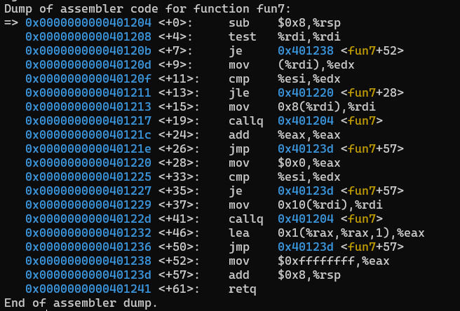

# CS:APP Lab Overview

All CS:APP labs share the following features:

- **Class tested at Carnegie Mellon.** The authors developed and refined the labs over a period of 10 years, on classes of 150-250 students. The course gets high evaluations from the students, who typically cite the labs as the reason they love the course.
- **Automatic testing and evaluation drivers.** Students develop their solution in a C file, which they then link into a C driver program. The driver runs their solution, checks for correctness, and produces a quantitative evaluation of their solution. Students use this feedback to incrementally refine their solutions.
- **Solutions.** Instructors are provided with complete solutions for each Lab.
- **Autograders.** Each lab (with the exception of the Proxy Lab) comes with an Perl autograder that runs the driver program on each student handin file and prints an ASCII grade sheet for each student.
- **Complete lab writeups.** Each lab comes with a complete writeup (in Latex) that provides context, step by step instructions, and an explanation of the evaluation criteria.

Copyright © 2015 Randal E. Bryant and David R. O'Hallaron

# CS:APP3e Lab Assignments

> csapp lab page: http://csapp.cs.cmu.edu/3e/labs.html
>
> csapp home page: http://csapp.cs.cmu.edu/

To untar foo.tar, type `tar xvf foo.tar` to the Unix shell. This will create a directory called "foo" that contains all of the material for the lab.

## Ch2-Data Lab

> 我修改了`Makefile`中指令`-m32`为`-m64`，该引用语句块用于解释原因和问题处理的过程记录。
>
> 由于起初编译无法通过，报错信息如下：
> 
> ```bash
>gcc -O -Wall -m32 -lm -o btest bits.c btest.c decl.c tests.c
> In file included from btest.c:16:
> /usr/include/stdio.h:27:10: fatal error: bits/libc-header-start.h: No such file or directory
> 27 | #include <bits/libc-header-start.h>
>    |          ^~~~~~~~~~~~~~~~~~~~~~~~~~
>    compilation terminated.
>    In file included from decl.c:1:
> /usr/include/stdio.h:27:10: fatal error: bits/libc-header-start.h: No such file or directory
> 27 | #include <bits/libc-header-start.h>
>    |          ^~~~~~~~~~~~~~~~~~~~~~~~~~
>    compilation terminated.
>    In file included from /usr/lib/gcc/x86_64-linux-gnu/9/include/limits.h:194,
>               from /usr/lib/gcc/x86_64-linux-gnu/9/include/syslimits.h:7,
>               from /usr/lib/gcc/x86_64-linux-gnu/9/include/limits.h:34,
>                  from tests.c:3:
>    /usr/include/limits.h:26:10: fatal error: bits/libc-header-start.h: No such file or directory
>    26 | #include <bits/libc-header-start.h>
>    |          ^~~~~~~~~~~~~~~~~~~~~~~~~~
>    compilation terminated.
>    make: *** [Makefile:11: btest] Error 1
> ```
> 
> 在使用`sudo apt install gcc-multilib`安装了对于32-bit程序的依赖库后，编译通过但无法运行，报错提示为：
>
> ```bash
>-bash: ./fshow: cannot execute binary file: Exec format error
> ```
> 
> 使用命令`file fshow`后控制台输出为：
>
> ```bash
>fshow: ELF 32-bit LSB shared object, Intel 80386, version 1 (SYSV), dynamically linked, interpreter /lib/ld-linux.so.2, BuildID[sha1]=997a290081e8b585528c7bcbdab82629817a1cb5, for GNU/Linux 3.2.0, not stripped
> ```
> 
> 目前未知出错原因，于是修改了`Makefile`中`CFLAGS = -O -Wall -m32`中的`-m32`为`-m64`，试图重新编译，提示
>
> ```bash
>make: Nothing to be done for 'all'.
> ```
> 
> 删去此前生成的可执行文件`btest`, `fshow`和`ishow`后重新编译，生成的可执行文件能正常运行。
>
> 此前编译通过时有关于`btest.c`的警告信息，与指定的程序运行32位还是64位环境应该无关，当前信息为`-m64`下编译产生，如下：
>
> ```bash
>gcc -O -Wall -m64 -lm -o btest bits.c btest.c decl.c tests.c
> btest.c: In function ‘test_function’:
> btest.c:332:23: warning: ‘arg_test_range[1]’ may be used uninitialized in this function [-Wmaybe-uninitialized]
> 332 |     if (arg_test_range[1] < 1)
>    |         ~~~~~~~~~~~~~~^~~
>   ```

### Implement

运行`dlc`检查不合法操作符等，不合法会提示，正常时无输出：

```bash
$ ./dlc bits.c
```

运行`btest`检查结果正确性，运行`./btest -f bitXor`，正确时提示如下：

```bash
Score   Rating  Errors  Function
 1      1       0       bitXor
Total points: 1/1
```

出错时，会告知出错的参数，如下：

```bash
Score   Rating  Errors  Function
ERROR: Test bitXor(-2147483648[0x80000000],-2147483648[0x80000000]) failed...
...Gives -1[0xffffffff]. Should be 0[0x0]
Total points: 0/1
```

实验很反直觉，我的做法是，先尽量底层的做出来正确做法，如果有不合法的运算符，之后想办法修改，首先保证正确性。如果无法实现，那就换思路做。

这种相当于是，先拿一个相对较强的条件完成，然后尽量替换原有的强条件来得出相同的结果。

我不确定使用两个逻辑非来制造确定的1或0是否是合适的做法，但我现在有两道题在使用这一策略，相当于是在限制了逻辑比较的前提下刻意使用逻辑非来制造控制的逻辑运算

```c
return !(y ^ (~y + 1)) & !(!y);
```

```c
return !(!(!flag1) & !(!flag2));
```

使用了`~0`来代替`-1`

剩下卡着的题都难顶（

估计是平均一道题两个小时。

> 位运算技巧学习网站 http://graphics.stanford.edu/~seander/bithacks.html#IntegerLogLookup

浮点数

其实虽然浮点数标记的困难增大，但我感觉，当能够使用C语言的各种东西之后，应该会比之前只能使用位运算要轻松多了吧。

魔怔了，为什么我要用位运算来拿符号位？而且注意，无符号是logic shift，right shift for signed is arithmetic shif

确实，当前面难顶的位运算解决结束之后，只要浮点数的基本概念和表示原理清楚，后面的实验做起来确实要顺手很多。

其实这里相当于是很好的理解了，当浮点数转换为整型造成的溢出问题。具体转换情形见代码注释。

浮点数转整数，2的整数次幂，现在就还差个整数转浮点数了，其实就是浮点数转整数倒着来而已，只是会有精读损失，而且不会有溢出的问题。

溢出的充要条件检查，这里要复习教材并整理。

终于，做完了datalab，明天整理整理代码，梳理一下重要的知识点，开始机器语言（其实想先看memory），今晚先睡了。


## Ch3-Bomb Lab

不小心把bomb写坏了（


才意识到，一个寄存器里面不可能存放下一整个字符串，那么字符串是存在哪里的，寄存器里面是什么？**指针**，这样才问题解决了，第一题算是正式折腾出来



有个文件读取的问题，这里读取到的文本格式异常


ASCII是UTF-8的子集，应该不会有问题才对，我推测是windows和linux文件表示的问题。推测正确的，是换行符的问题，linux文件系统的换行符和windows的不同导致


把编码从CRLF改成LF重新保存就可以直接读取了

第二个虽然一个一个搞出来了，但是应该有更直接的做法，从栈里面看，而不是每次读寄存器里面做对比的值。


折腾到现在，终于是把内存里面的值找到了


使用`set`命令来修改内存和寄存器里面的值，这里改为小于等于7的都可以。

```shell
set {int}($rsp+0x8) = 7
```

注意，使用指针来修改的时候要强转，因为默认都是`void*`类型

```shell
set *(int*)($rsp+0xc)=327
```

看得出来，前面几个实验设置出主要是为了让学生熟悉了gdb使用。

第四题，也是读入数值，读入的两个数值，但是要经过计算，这里先在中间修改内存跑出来结果的办法行不通了，要看它运算的逻辑是什么。

phase_defused 解析

从开始进入这个函数，就是做的stack randomization，几条关键的跳转语句和判断语句

```assembly
   0x00000000004015c4 <+0>:     sub    $0x78,%rsp                   // allocate 120 = 8 * 15 byte
   0x00000000004015c8 <+4>:     mov    %fs:0x28,%rax                // 0x68:0x70 = rax
   0x00000000004015d1 <+13>:    mov    %rax,0x68(%rsp)              
   0x00000000004015d6 <+18>:    xor    %eax,%eax                    // rax = 0
   0x00000000004015d8 <+20>:    cmpl   $0x6,0x202181(%rip)          // 0x603760 <num_input_strings>
   0x00000000004015df <+27>:    jne    0x40163f <phase_defused+123> //
   ...
   0x000000000040163f <+123>:   mov    0x68(%rsp),%rax
   0x0000000000401644 <+128>:   xor    %fs:0x28,%rax
   0x000000000040164d <+137>:   je     0x401654 <phase_defused+144>
   0x000000000040164f <+139>:   callq  0x400b30 <__stack_chk_fail@plt>
   0x0000000000401654 <+144>:   add    $0x78,%rsp
   0x0000000000401658 <+148>:   retq
```

现在暂时不清楚这是在做具体的什么检查，但是知道和我要做的基本不相关就是了。

原来是一个secret phase，当做附加题吧，最后一个来解。我是说每次怎么都只执行了其中的一小段，中间必然有个无法成功的判断语句使得无法进行这样的跳转。现在明白了之前试出来的两个数字加一个字符串是什么了。这个附加题可能在每个阶段都可以做，从他读取到的是空字符串可以推断。有点想看看这里是在干什么（

当执行到的时候，按理说是相等的，就是6，但是不知道为什么会跳转到我想的位置之外。我觉得可能需要修改flag的值

> https://stackoverflow.com/questions/12395477/interpreting-eflags-in-ddd

```
bit | sym | name
------------------
  0 |  CF | carry
  1 |  -- | (always 1)
  2 |  PF | parity
  3 |  -- | (always 0)
  4 |  AF | adjust
  5 |  -- | (always 0)
  6 |  ZF | zero
  7 |  SF | sign
  8 |  TF | trap
  9 |  IF | interrupt
 10 |  DF | direction
 11 |  OF | overflow
```

问题出现了，eflags的值是不能被gdb修改的，这可能需要一定的设定。那我的办法就要放在修改之前比较结果的地方。

```shell
set style address foreground cyan
```

明白了，问题出在，如果当前指令没有被执行的时候，`%rip`是指向当前指令的内容的，而当正在执行当前指令的时候，`%rip`是指向下一条指令的内容的，所以要修改下一条指令的内容而不是当前的指令地址对应的内存。



成功了，而且我在输入的时候添加了两个数字和一个字符串，应该能满足输入的要求，等下需要的就是把答案搞出来。

还是不对，输入的多余字符串没有被读入，而且可能之后会影响到第三题。这个隐藏关卡应该不是在这里通过的。

```assembly
0x00000000004015d8 <+20>:    cmpl   $0x6,0x202181(%rip)        # 0x603760 <num_input_strings>
```

在这里被传入用于进行比较的字串是`DrEvil`

```assembly
=> 0x0000000000401604 <+64>:    mov    $0x402622,%esi
   0x0000000000401609 <+69>:    lea    0x10(%rsp),%rdi
   0x000000000040160e <+74>:    callq  0x401338 <strings_not_equal>
```

```
DrEvil
```

这里的返回值应该是用来判断是否正确输入进入隐藏关卡的密码，如果输入正确就会提示：


那么我等出来之后修改返回值的值或者传入两个相同地址的字串就可以了。


按理说，我传入的时候是修改了字符串的地址的，所以不应该出现`%eax`等于0的情况。好吧，我本来是对的，直接传入两个相同地址的字符串这里没有检查问题，但是我在出来之后再修改了`%eax`的值之后就错了。。。



但是我不理解这里是我哪里想错了吗？


先不折腾了，老老实实解题，第四题都还没做。

第四题里面有递归调用，还是需要把原来的C代码还原出来。这道题是个多解题，目前猜到的答案有0,1,7，虽然还原了C代码，但是还是不完全能理解这是在做什么，当然，现在能够通过就行，那接下来等做完之后再把答案找全。

> 可以暴力跑。。。小于等于14，但是这样没有考虑负数
>
> 0,1,3,7

第五题最核心的就是这里操作字符的做法了


需要明确rdx,edx,dl都是同一个寄存器的不同部分，但实际上都是只在操作那一个字符，在经过按位与`0xf`之后，由此得出的地址偏移量来从`"maduiersnfotvbyl"`字符串中取一个字符作为答案`flyers`的组成部分，我猜，但大致思路应该是对的。

好了，看到最后在`0x16($rsp)`这里添加了一个0，就知道我猜对了，传参答案是`flyers`，现在只需要计算一下我之前需要填入的字符串是什么就好了。

最后得到的可选结果如下，每行任选一个字符组成即可：



除此以外，隐藏关卡应该也不是在这里打开，这里要检查字符串长度，没有多余的位置拿给我输入。事实上，第4题和5题都比较顺畅，解决速度比前三题快多了，当然这归功于gdb的使用相对熟悉了，读不复杂的汇编也能很快理解了。

最后一题了。


```assembly
Dump of assembler code for function phase_6:
=> 0x00000000004010f4 <+0>:     push   %r14
   0x00000000004010f6 <+2>:     push   %r13
   0x00000000004010f8 <+4>:     push   %r12
   0x00000000004010fa <+6>:     push   %rbp
   0x00000000004010fb <+7>:     push   %rbx
   0x00000000004010fc <+8>:     sub    $0x50,%rsp
   0x0000000000401100 <+12>:    mov    %rsp,%r13
   0x0000000000401103 <+15>:    mov    %rsp,%rsi
   0x0000000000401106 <+18>:    callq  0x40145c <read_six_numbers>
   0x000000000040110b <+23>:    mov    %rsp,%r14
   0x000000000040110e <+26>:    mov    $0x0,%r12d
   0x0000000000401114 <+32>:    mov    %r13,%rbp
   0x0000000000401117 <+35>:    mov    0x0(%r13),%eax
   0x000000000040111b <+39>:    sub    $0x1,%eax
   0x000000000040111e <+42>:    cmp    $0x5,%eax
   0x0000000000401121 <+45>:    jbe    0x401128 <phase_6+52>
   0x0000000000401123 <+47>:    callq  0x40143a <explode_bomb>
   0x0000000000401128 <+52>:    add    $0x1,%r12d
   0x000000000040112c <+56>:    cmp    $0x6,%r12d
   0x0000000000401130 <+60>:    je     0x401153 <phase_6+95>
   0x0000000000401132 <+62>:    mov    %r12d,%ebx
   0x0000000000401135 <+65>:    movslq %ebx,%rax
   0x0000000000401138 <+68>:    mov    (%rsp,%rax,4),%eax
   0x000000000040113b <+71>:    cmp    %eax,0x0(%rbp)
   0x000000000040113e <+74>:    jne    0x401145 <phase_6+81>
   0x0000000000401140 <+76>:    callq  0x40143a <explode_bomb>
   0x0000000000401145 <+81>:    add    $0x1,%ebx
   0x0000000000401148 <+84>:    cmp    $0x5,%ebx
   0x000000000040114b <+87>:    jle    0x401135 <phase_6+65>
   0x000000000040114d <+89>:    add    $0x4,%r13
   0x0000000000401151 <+93>:    jmp    0x401114 <phase_6+32>
   0x0000000000401153 <+95>:    lea    0x18(%rsp),%rsi
   0x0000000000401158 <+100>:   mov    %r14,%rax
   0x000000000040115b <+103>:   mov    $0x7,%ecx
   0x0000000000401160 <+108>:   mov    %ecx,%edx
   0x0000000000401162 <+110>:   sub    (%rax),%edx
   0x0000000000401164 <+112>:   mov    %edx,(%rax)
   0x0000000000401166 <+114>:   add    $0x4,%rax
   0x000000000040116a <+118>:   cmp    %rsi,%rax
   0x000000000040116d <+121>:   jne    0x401160 <phase_6+108>
   0x000000000040116f <+123>:   mov    $0x0,%esi
   0x0000000000401174 <+128>:   jmp    0x401197 <phase_6+163>
   0x0000000000401176 <+130>:   mov    0x8(%rdx),%rdx
   0x000000000040117a <+134>:   add    $0x1,%eax
   0x000000000040117d <+137>:   cmp    %ecx,%eax
   0x000000000040117f <+139>:   jne    0x401176 <phase_6+130>
--Type <RET> for more, q to quit, c to continue without paging--
   0x0000000000401181 <+141>:   jmp    0x401188 <phase_6+148>
   0x0000000000401183 <+143>:   mov    $0x6032d0,%edx
   0x0000000000401188 <+148>:   mov    %rdx,0x20(%rsp,%rsi,2)
   0x000000000040118d <+153>:   add    $0x4,%rsi
   0x0000000000401191 <+157>:   cmp    $0x18,%rsi
   0x0000000000401195 <+161>:   je     0x4011ab <phase_6+183>
   0x0000000000401197 <+163>:   mov    (%rsp,%rsi,1),%ecx
   0x000000000040119a <+166>:   cmp    $0x1,%ecx
   0x000000000040119d <+169>:   jle    0x401183 <phase_6+143>
   0x000000000040119f <+171>:   mov    $0x1,%eax
   0x00000000004011a4 <+176>:   mov    $0x6032d0,%edx
   0x00000000004011a9 <+181>:   jmp    0x401176 <phase_6+130>
   0x00000000004011ab <+183>:   mov    0x20(%rsp),%rbx
   0x00000000004011b0 <+188>:   lea    0x28(%rsp),%rax
   0x00000000004011b5 <+193>:   lea    0x50(%rsp),%rsi
   0x00000000004011ba <+198>:   mov    %rbx,%rcx
   0x00000000004011bd <+201>:   mov    (%rax),%rdx
   0x00000000004011c0 <+204>:   mov    %rdx,0x8(%rcx)
   0x00000000004011c4 <+208>:   add    $0x8,%rax
   0x00000000004011c8 <+212>:   cmp    %rsi,%rax
   0x00000000004011cb <+215>:   je     0x4011d2 <phase_6+222>
   0x00000000004011cd <+217>:   mov    %rdx,%rcx
   0x00000000004011d0 <+220>:   jmp    0x4011bd <phase_6+201>
   0x00000000004011d2 <+222>:   movq   $0x0,0x8(%rdx)
   0x00000000004011da <+230>:   mov    $0x5,%ebp
   0x00000000004011df <+235>:   mov    0x8(%rbx),%rax
   0x00000000004011e3 <+239>:   mov    (%rax),%eax
   0x00000000004011e5 <+241>:   cmp    %eax,(%rbx)
   0x00000000004011e7 <+243>:   jge    0x4011ee <phase_6+250>
   0x00000000004011e9 <+245>:   callq  0x40143a <explode_bomb>
   0x00000000004011ee <+250>:   mov    0x8(%rbx),%rbx
   0x00000000004011f2 <+254>:   sub    $0x1,%ebp
   0x00000000004011f5 <+257>:   jne    0x4011df <phase_6+235>
   0x00000000004011f7 <+259>:   add    $0x50,%rsp
   0x00000000004011fb <+263>:   pop    %rbx
   0x00000000004011fc <+264>:   pop    %rbp
   0x00000000004011fd <+265>:   pop    %r12
   0x00000000004011ff <+267>:   pop    %r13
   0x0000000000401201 <+269>:   pop    %r14
   0x0000000000401203 <+271>:   retq
End of assembler dump.
```

艹，怎么这么长，突然传来一股浓浓的嘲讽味，量变引起质变是吧（


虽然必定是需要逐行逐行执行代码来看它在干什么的，刚来应该还是要集中把它的大体框架猜出来。


通过分析，这一段代码，是在检查每一个数值是否和后面的所有数值不同，并且每个数都要小于等于6，每个数都不能是0，因为是无符号整型在比较大小。换句话讲，到这里为止，满足输入的所有情况是[123456]的全排列。这时候其实已经可以开始爆破了，但是为了解题，我还是选择思考正解，因为逻辑看起来并不复杂。


这一段代码是把原来读到内存里面的那六个数`[x0 x1 ... x5]`处理一下，得到`[7-x0 7-x1 ... 7-x5]`，`%rsi`是用来检查指针越界的。

破防了，后面乱七八糟的跳转让我不能推断他在做什么，我只看到了一个在处理1的时候的跳转流程，但是如果顺序不对的话是不能得到正确结果的。

我觉得主要是我在不停的切换计算的顺序，但也有一部分原因是我不能理解中间的计算过程是在做什么。观察到了一个很奇怪的信息，`0x6032d0`这个地址或者什么东西被用了几次，但是我没能正确的读取这个地址的内容。

文件末要加换行符。

记录一下几个我觉得有问题的地方，strings打出来的

```
0000000000401204 g     F .text    000000000000003e              fun7
...
00000000006032f0 g     O .data    0000000000000010              node3
0000000000000000       F *UND*    0000000000000000              read@@GLIBC_2.2.5
0000000000000000       F *UND*    0000000000000000              __libc_start_main@@GLIBC_2.2.5
0000000000000000       F *UND*    0000000000000000              fgets@@GLIBC_2.2.5
000000000040143a g     F .text    0000000000000022              explode_bomb
00000000006032d0 g     O .data    0000000000000010              node1
00000000006030e0 g       .data    0000000000000000              __data_start
0000000000000000       F *UND*    0000000000000000              signal@@GLIBC_2.2.5
0000000000000000       F *UND*    0000000000000000              gethostbyname@@GLIBC_2.2.5
0000000000603310 g     O .data    0000000000000010              node5
...
00000000006032e0 g     O .data    0000000000000010              node2
0000000000603300 g     O .data    0000000000000010              node4
0000000000000000       F *UND*    0000000000000000              sleep@@GLIBC_2.2.5
0000000000603320 g     O .data    0000000000000010              node6
```

secret_phase我已经知道了答案，只是目前还不知道如何正常进入，这个涉及到指令取值，我怎么感觉要代码注入？

fun7有点奇怪，第七个函数怎么来的？也许和这个函数的地址有关系。先到这里，等下休息会再继续想。或者可以先把答案爆破出来，720种对于计算机来说真的太少了。

还是倾向于思考正解，不过学习爆破的代码写法也是很重要的，有限的枚举是很自然的做法。

从node1到node6，是我自然的想法，那么我有理由认为我第一个是1猜的是对的。

艹，猜的对个p。。。昏沉发蒙的大脑已经放弃思考他的逻辑了，最终靠半小时写了个暴力枚举出来答案。



先这样了，过于疲倦。等下把secret_phase进入的办法找出来，这个应该简单多了。

```assembly
x/x 0x202181+0x00000000004015df
0x603760 <num_input_strings>:   0x00000001
```

在不同阶段进入的时候，这一行的取值从1变化到6，这么看来，是只有在最后阶段才能进入

```
DrEvil
```



一个没有用过的函数`strtol()`，作用是`converting string to long integer`，根据基k的取值得出k-进制数（所给字符串）的10进制数值。

> https://www.cplusplus.com/reference/cstdlib/strtol/

函数原型为

```c
long int strtol (const char* str, char** endptr, int base);
```

对应到汇编代码的参数就是，`strtol($rax, $rsi, $rdx)`，这里只读取一个字符串并且直接转为数值，应该就是只读入一个数。



之前注意到的`fun7`

通过指针域的特征以及一个意外的提示注意到了，这是个二叉树，结点用n1开始标记。但是用到的结点只有15个。还有就是，这个递归调用有点像构造或者遍历之类的。由于没有动态内存分配，推测可能已经是构造好了的（这一点可以从数值已经在结点中存在推断）

好像是个查询操作，类似二叉搜索树。妙啊，懂了！访问左子树，回来的时候\*2，访问右子树，回来的时候\*2+1，那么就要左走一步再右走一步，返回的时候先变成1，再翻倍成2。也明白了，奇怪的编号第一个数字是指层数。

```
0000000000603190 g     O .data	0000000000000018              n31
0000000000603170 g     O .data	0000000000000018              n33
0000000000603230 g     O .data	0000000000000018              n44
0000000000603290 g     O .data	0000000000000018              n46
0000000000603250 g     O .data	0000000000000018              n42
00000000006032b0 g     O .data	0000000000000018              n48
0000000000603130 g     O .data	0000000000000018              n22
00000000006030f0 g     O .data	0000000000000018              n1
00000000006031b0 g     O .data	0000000000000018              n34
0000000000603150 g     O .data	0000000000000018              n32
0000000000603210 g     O .data	0000000000000018              n47
0000000000603270 g     O .data	0000000000000018              n43
00000000006031f0 g     O .data	0000000000000018              n41
00000000006031d0 g     O .data	0000000000000018              n45
0000000000603110 g     O .data	0000000000000018              n21
```

终于结束了，虽然phase_6还需要之后再想想它的逻辑，不过有了答案应该能正向走几遍看懂它在干什么。phase_4应该也能想出来正解了，两个人脑反汇编出来的C代码感觉结构挺相似的。


