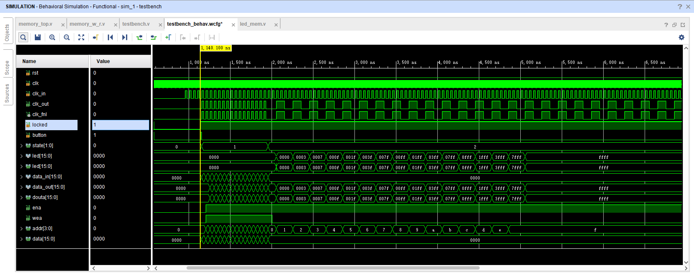

## 实验3 利用IP设计电路

### memory_w_r

#### 仿真波形

* 写入数据波形

  

* 全局波形概览

  

#### 波形分析

##### 功能简述

* 模块 memory_top.v

  主要完成对3个模块的调用，以及对各模块输出管脚和输入进行恰当的链接，同时对于在模块内部部分不容易处理的特殊情形进行专门的处理。

* 模块 memory_w_r.v

  主要完成对电路状态的记录，将该电路分为0,1,2三种状态，分别对应于初始时和重置状态，启动后写入数据状态，写入完成后读取数据状态。不同状态下，各类信号的控制有所不同

* IP核 clk_div 

  对原始100MHz的时钟分频为20MHz，当分频时钟稳定后，locked信号升到高位。

* IP核 led_mem

  控制数据的写入和读取，其中写入和读取共用地址，读取数据在写入的下一时钟周期进行。

##### 自定义信号列表

* **state**为电路运行状态信号，用于标记电路所处的工作状态，三种状态定义如下

  ```verilog
  parameter STATE_INIT     = 2'd0;
  parameter STATE_WRITE    = 2'd1;
  parameter STATE_READ     = 2'd2;
  ```

* **clk_20mhz, clk_fnl**分别为，时钟IP核输出的时钟信号和由memory_w_r模块控制的输出信号，作为led_mem的输入

* **flag**在两个模块中分别临时处理不同的特殊情况

##### 时序分析

* 由波形图可以见得，在按下button启动之后，state状态从0变为了1；在第一次地址偏移到ffff的时候，state从1变为了0，完成了对于电路不同工作阶段的控制。
* 由波形图可以看到，data_in数据写入后的下一个周期data_out完成读取，其中data_out和存储器模块的douta数值相同，说明读取成功，完成了对ram的写入和读取。
* 由clk信号波形可以见得，在locked信号升到高电平之前，clk_fnl信号始终处于低电平0，在locked升为高电平之后，开始写入数据，此时使用的是20MHz始终信号，在写入完成之后，切换到5MHz信号完成数据的读取，说明实现了利用IP核时钟控制的功能。

综上所述，本次实验代码完成了利用IP进行电路设计的功能，上板验证通过，仿真波形正确。