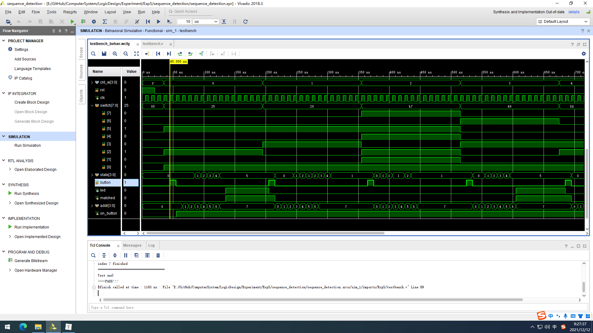

## 实验5 序列检测器设计 仿真波形分析

### sequence_detection

#### 仿真波形

#### 波形分析

sequence_detection实验是实现对给定文本串的子序列进行检测

* 文本串信号由拨码开关给出，从switch[7]到switch[0]；待匹配模式串预先设定在代码中
* 当rst处于高电平时，检测器不工作，处于重置状态（即初始化状态）
* 当rst处于低电平，且button触发一次高电平时，开始对当前指定序列进行检测
* 每次的检测结果由led[0]位置的信号给出，对应到开发板上第零位led高亮为检测通过

##### 信号定义

* **clk**为时钟信号，为了便于处理并行操作而使用的时序电路，每一位检测时间间隔为1个时钟周期
* **rst**为复位信号，仿真过程中在初始时复位信号高电平，其他时候低电平代表即将开始工作或者已经处于工作状态
* **button**为检测器开始检测的启动信号，信号高电平触发后，检测器处于工作状态，每次按下时重置检测器的检测状态state，重新开始检测，目的在于便于连续进行多次的序列检测

* **on_button**为检测器处于工作状态的信号，为了与state相区分，这里的on_button信号只判断是否按下过button，只完成这一功能
* **state**为序列检测器的状态信号，同样也是模式串连续匹配成功的位置，在对每一位进行连续检测的时候，状态根据状态转移表对应的结果进行转移，当状态转移到5，达成匹配时，led点亮
* **switch**为文本串，**addr**为文本串偏移量，**switch[7-addr]**表示文本串和模式串进行比较的字符
* **led**为检测判断信号，led高亮时当前序列检测通过，led熄灭时当前序列检测不通过或者当前未触发button对状态进行重置

##### 状态转移表

给定有限状态机$M$，$M=\{Q,q_0,A,\Sigma,\delta\}$定义如下

* $Q=\{0,1,2,3,4,5\}$是状态的集合，即有限状态机中所有可能出现的转移状态
* $q_0=0$是有限状态自动机的起始状态，$q_0 \in Q$
* $A=\{5\}$是可接受状态集合，$A\subseteq Q$
* $\Sigma=\{0,1\}$为所有可能输入的字符集合
* $\delta(q,\alpha)=\max\{k:p[0:k]\text{是}p[0:q]\alpha\text{的后缀}\}$ 为状态转移函数，$\alpha$为当前检测字符，$q$为状态，$p$为模式串。状态转移函数由状态转移表给出

本实验的有限状态自动机状态转移表计算如下，其中p为模式串10010（连续匹配成功的字符集对应字符列的状态已经加粗显示）：

| $state$ | $0$   | $1$   | $p[i]$ |
| ------- | ----- | ----- | ------ |
| 0       | 0     | **1** | 1      |
| 1       | **2** | 1     | 0      |
| 2       | **3** | 1     | 0      |
| 3       | 0     | **4** | 1      |
| 4       | **5** | 1     | 0      |
| 5       | 0     | 1     |        |

##### 波形时序分析

以启动过程和testbench中第一次检测为例对本实验波形进行分析，其余部分同理，检测失配时即跳转到对应的状态

* 对于启动过程的分析

  | clk(ns) | rst  | switch(hex) | switch(bin)     | state | button  | addr | on_button | led  | matched |
  | ------- | ---- | ----------- | --------------- | ----- | ------- | ---- | --------- | ---- | ------- |
  | 0-55    | 1=>0 | 00=>8'h25   | 0=>8'b0010_0101 | 0     | 0=>1=>0 | 0    | 0=>1      | 0    | 0       |

  * 在0-20ns时，rst处于高电平，之后处于低电平，表示检测器即将开始工作
  * 在20-35ns时，switch信号开始变更，表示输入了待检测序列
  * 在45-55ns时，button高电平触发一次，之后回到低电平，此后从55ns起，on_button开始处于高电平，表示序列检测器开始检测

* 对于第一次匹配成功的检测过程的分析

  | clk(ns) | rst  | switch       | switch(bin)                | state         | button  | addr          | on_button | led  | matched |
  | ------- | ---- | ------------ | -------------------------- | ------------- | ------- | ------------- | --------- | ---- | ------- |
  | 55-85   | 0    | 8'h25        | 8'b0010_0101               | 0=>1          | 0       | 0=>1=>2       | 1         | 0    | 0       |
  | 85-125  | 0    | 8'h25        | 8'b0010_0101               | 1=>2=>3=>4=>5 | 0       | 2=>3=>4=>5=>6 | 1         | 0    | 0       |
  | 125-135 | 0    | 8'h25        | 8'b0010_0101               | 5             | 0       | 6=>7          | 1         | 0=>1 | 0=>1    |
  | 135-215 | 0    | 8'h25=>8'h29 | 8'b0010_0101=>8'b0010_1001 | 5=>0          | 0=>1=>0 | 7=>0          | 1         | 1=>0 | 1=>0    |

  * 在开始检测后，55-75两个时钟周期中匹配失败，模式串前两位为10，文本串为00，故连续匹配失败，由状态转移表可知状态转移至初始的状态0
  * 在75-85ns时，模式串首位1和文本串001位置的字符匹配成功，状态转移至1，代表已匹配成功的前缀字符长度，此后到135ns为止连续匹配成功，状态转移方式同理
  * 在135-205ns时，序列检测器处于匹配成功的过程，状态保持为5，led常亮
  * 在205-215ns时，button高电平触发一次，状态清0，led由于组合逻辑方式连接实时变化为0，matched匹配检测信号在下一个时钟周期到来时置0

综上所述，本模块实现了序列检测器的功能，仿真通过，上板对于更多实例验证成功，说明该模块确实实现了状态机检测给定字符串子串的功能，说明该实验完成良好。