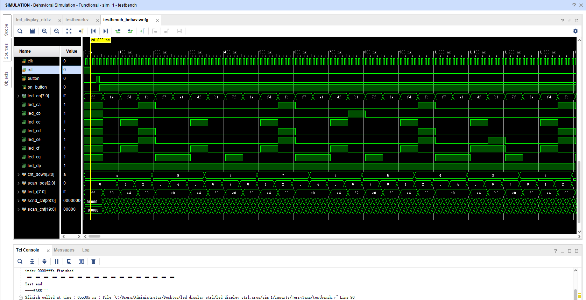

## 实验4 数码管控制器设计 仿真波形分析

### led_display_ctrl

#### 仿真波形

#### 波形分析

##### 功能简述

led_display_ctrl实验是实现对数码管的控制：

* 当按一次button启动控制器之后，8位数码管显示数值，按下rst后重置，数码管均不亮
* 其中，数值的显示规则为：最左边两位为从10开始的循环倒计时器，计时周期为11s，之后的数值为200428

##### 信号定义

* **clk**为时钟信号，在启动后每经过5个时钟周期，scan_pos的值+1（从0-7循环计数），每经过15个时钟周期，cnt_down的值-1（0xA-0x0循环计数）
* **rst**为复位信号，在任意时刻复位之后，scan_pos清零，cnt_down的值复位为起始计数数值（本例中为10，即0xA）
* **cnt_down**为计数器数值控制信号，最左两位数码管显示的数值由该信号决定
* **scan_pos**为数码管扫描位控制信号，用来决定点亮的数码管编号
* **button**为启动信号，从复位状态按下button后，控制器开始工作
* **on_button**为工作状态标记信号，在按下button后的下一个时钟上沿到来时，将置为1，标记控制器处于工作状态
* **led_en**为数码管片选控制信号，信号高电平位置的8位数码管不工作，低电平位置的数码管工作，任意时刻最多只有一个数码管处于工作状态，减小能耗。
* **led_r**为数码管段选控制信号，在代码中对led_dp~led_ca按从高到低排列后进行赋值，便于控制点亮的数码管段。
* **scnd_cnt**和**scan_cnt**为时钟计数器，分别获得1s（仿真中15时钟周期）和2ms（仿真中5时钟周期）的时间

##### 时序分析

| clk(ns) | rst  | button | on_button | led_en(hex) | led_r(hex) | cnt_down(hex) | scan_pos |
| ------- | ---- | ------ | --------- | ----------- | ---------- | ------------- | -------- |
| 0-20    | 1    | 0      | 0         | ff          | ff         | a             | 0        |
| 35-45   | 0    | 0=>1   | 0         | ff          | ff         | a             | 0        |
| 45-55   | 0    | 1=>0   | 0=>1      | ff          | ff         | a             | 0        |
| 55-105  | 0    | 0      | 1         | fe          | 80         | a             | 0=>1     |
| 105-155 | 0    | 0      | 1         | fd          | a4         | a             | 1=>2     |
| 155-205 | 0    | 0      | 1         | fb          | 99         | a=>9          | 2=>3     |
| 205-255 | 0    | 0      | 1         | f7          | c0         | 9             | 3=>4     |
| 255-305 | 0    | 0      | 1         | ef          | c0         | 9             | 4=>5     |
| 305-355 | 0    | 0      | 1         | df          | a4         | 9=>8          | 5=>6     |
| 355-405 | 0    | 0      | 1         | bf          | 80         | 8             | 6=>7     |
| 405-455 | 0    | 0      | 1         | 7f          | c0         | 8             | 7=>0     |
| 455-505 | 0    | 0      | 1         | fe          | 80         | 8=>7          | 0=>1     |
| 505-555 | 0    | 0      | 1         | fd          | a4         | 7             | 1=>2     |
| 555-605 | 0    | 0      | 1         | fb          | 99         | 7             | 2=>3     |
| 605-655 | 0    | 0      | 1         | f7          | c0         | 7=>6          | 3=>4     |
| 655-705 | 0    | 0      | 1         | ef          | c0         | 6             | 4=>5     |
| 705-755 | 0    | 0      | 1         | df          | a4         | 6             | 5=>6     |
| 755-805 | 0    | 0      | 1         | bf          | 82         | 6=>5          | 6=>7     |
| 805-855 | 0    | 0      | 1         | 7f          | c0         | 5             | 7=>8     |

由上表可以见得，对于不同扫描周期，数码管位置和点亮的数值对应如下：

| clk(ns) | 7    | 6    | 5    | 4    | 3    | 2    | 1    | 0    |
| ------- | ---- | ---- | ---- | ---- | ---- | ---- | ---- | ---- |
| 55-455  | c0   | 80   | a4   | c0   | c0   | 99   | a4   | 80   |
|         | 0    | 8    | 2    | 0    | 0    | 4    | 2    | 8    |
| 455-855 | c0   | 82   | a4   | c0   | c0   | 99   | a4   | 80   |
|         | 0    | 6    | 2    | 0    | 0    | 4    | 2    | 8    |

由已知条件

* cnt_down开始为8以及scan_pos扫描到6时的时钟均为345ns，在下一个时钟上沿到来时即355ns时，led_r显示数值为0x80，查表知为数值8
* 在下一次scan_pos扫描到6的时钟为745ns，在755ns时led_r显示数值为0x82，查表知为数值6

两次时间间隔为745ns-345ns=400ns=40*10ns，由计数规则

* 每经过15个时钟周期，cnt_down-1
* 每经过5个时钟周期，scan_pos+1

cnt_down理论的变化量为40/15=2.667，即经过完整的两个变化，保持第三次数值尚未更新，则cnt_down所处的数值应当是8-2=6，与实际符合，说明计数器工作正常，对于高位1到0变化同理，不再赘述。

scan_pos的理论变化量为40/5=8.0，即经过8次完整的变化，则scan_pos所处的数值应当是(6+8)%8=6，与实际相符，说明数码管扫描控制器工作正常。

综上所述，该模块完成了数码管控制器应有的功能，同时仿真波形正确，仿真测试通过，上板验证通过，说明该实验目标完成良好。

#### 附录

数码管段选控制表

| char | dp   | g    | f    | e    | d    | c    | b    | a    | bin      | hex  |
| ---- | ---- | ---- | ---- | ---- | ---- | ---- | ---- | ---- | -------- | ---- |
| 0    | 1    | 1    | 0    | 0    | 0    | 0    | 0    | 0    | 11000000 | c0   |
| 1    | 1    | 1    | 1    | 1    | 1    | 0    | 0    | 1    | 11111001 | f9   |
| 2    | 1    | 0    | 1    | 0    | 0    | 1    | 0    | 0    | 10100100 | a4   |
| 3    | 1    | 0    | 1    | 1    | 0    | 0    | 0    | 0    | 10110000 | b0   |
| 4    | 1    | 0    | 0    | 1    | 1    | 0    | 0    | 1    | 10011001 | 99   |
| 5    | 1    | 0    | 0    | 1    | 0    | 0    | 1    | 0    | 10010010 | 92   |
| 6    | 1    | 0    | 0    | 0    | 0    | 0    | 1    | 0    | 10000010 | 82   |
| 7    | 1    | 1    | 1    | 1    | 1    | 0    | 0    | 0    | 11111000 | f8   |
| 8    | 1    | 0    | 0    | 0    | 0    | 0    | 0    | 0    | 10000000 | 80   |
| 9    | 1    | 0    | 0    | 1    | 1    | 0    | 0    | 0    | 10011000 | 98   |